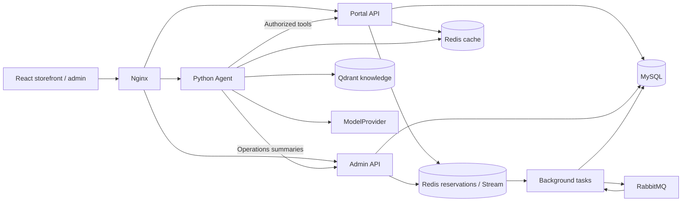

# HotShop

**Good finds. Great days.** A full-stack commerce application with an AI shopping assistant, flash-sale reservations, orders, and an operations console.

[简体中文](README.md) · **English** · [Documentation](docs/README.md) · [Demo guide](docs/delivery/demo.md)

[](https://github.com/LBBZ/hotShop/actions/workflows/ci.yml)


## From discovery to a confirmed purchase

HotShop brings a working shopping experience and its transaction infrastructure into one repository. Users can browse products, join flash sales, track orders, or ask an assistant to compare products and prepare a purchase draft. Administrators have a separate workspace for catalog, inventory, campaigns, audits, and operational summaries.

| Experience            | What is implemented                                                                                         |
| --------------------- | ----------------------------------------------------------------------------------------------------------- |
| Product discovery     | Search, category filters, product details, regular purchases, original category illustrations               |
| Flash sales           | Countdown, inventory reservation, one active reservation per user per campaign, asynchronous order progress |
| Personal workspace    | Registration, sign-in, orders, reservations, payment status, and timeout closure status                     |
| Shopping assistant    | Product search and comparison, the user's own orders, knowledge answers with citations                      |
| Purchase confirmation | The assistant prepares a draft; the user confirms it before an order is created                             |
| Operations            | Product maintenance, explicit stock adjustments, campaign loading, audits, and exception summaries          |

The interface supports keyboard navigation, narrow screens, and reduced motion. Product cards label their illustrations as category artwork because the catalog API does not currently provide product photos. The application interface and detailed guides are primarily in Simplified Chinese.

## Run the demo

From the repository root, with **Docker Engine / Docker Desktop using Linux containers, Docker Compose 2.24.4+, and PowerShell 7+**:

```powershell
pwsh -NoProfile -File ./script/task21-demo.ps1 -Action Start
```

The first run downloads dependencies and builds images. The script creates an isolated Compose project, random credentials and signing keys, migrates the database, seeds demo products and flash sales, and indexes the knowledge base. Open **http://127.0.0.1:18080** when it is ready and register a user. The [demo guide](docs/delivery/demo.md) includes the administrator entry point and demo credentials. FakeModel and deterministic embeddings are enabled by default; no model API key is required.

Keep the project name printed by the script. Replace the example name below with that value:

```powershell
pwsh -NoProfile -File ./script/task21-demo.ps1 -Action Status -ProjectName hotshop-task21-xxxxxxxxxxxx
pwsh -NoProfile -File ./script/task21-demo.ps1 -Action Restart -ProjectName hotshop-task21-xxxxxxxxxxxx
pwsh -NoProfile -File ./script/task21-demo.ps1 -Action Stop -ProjectName hotshop-task21-xxxxxxxxxxxx
```

`Restart` preserves data without reseeding inventory or extending campaigns. `Stop` only stops that project's containers, preserving its data and keys. To use another port, pass `-WebPort 18081` on the initial start. See the [container guide](docs/runbooks/container-environment.md) and [contribution guide](CONTRIBUTING.md) for manual setup and development.

## How it works

HotShop is a **modular, multi-process application in one repository**. Java processes share domain code and MySQL. The Python Agent uses restricted HTTP tools, and Nginx provides a same-origin browser entry point.



- **Regular purchases** validate prices, deduct stock, and create orders and Outbox records in a MySQL transaction, with idempotency keys for retries.
- **Flash-sale reservations** use Redis Lua to validate an activity, reserve stock, and append a Stream event atomically. Background workers create orders; recovery, compensation, and reconciliation handle failures.
- **Reliable messaging** combines a transactional Outbox, publisher confirms, and consumer idempotency for deduplication under at-least-once delivery.
- **AI purchase boundaries** enforce identity, resource ownership, scopes, and a single-use confirmation value. Models cannot pay or bypass user confirmation.
- **Authentication** separates user, administrator, and Agent credentials. Access tokens stay in browser memory; refresh sessions, revocation markers, and service assertion replay markers are persisted in MySQL.

Read the [current architecture](docs/architecture/current-state.md), [transaction journey](docs/architecture/user-transaction-journey.md), and [API contract](docs/api/api-contract.md) for details.

## Stack and source map

| Layer                       | Current baseline                                         | Source                                      |
| --------------------------- | -------------------------------------------------------- | ------------------------------------------- |
| Web                         | React 19, TypeScript 6, Vite 8, Tailwind CSS 4, pnpm 10  | [`web/`](web/README.md)                     |
| Commerce and administration | Java 21, Spring Boot 4.1, Jackson 3, MyBatis             | `portal/`, `admin/`, `domain/`, `security/` |
| Background processing       | Redis Lua / Stream, RabbitMQ, transactional Outbox       | `task/`, `common/`, `infrastructure/`       |
| Data                        | MySQL 8.4, Flyway, two Redis 8.8 instances, RabbitMQ 4.3 | `database/`, [Compose](docker-compose.yml)  |
| AI                          | Python 3.12, FastAPI, LangGraph, Qdrant 1.19             | `agent/`                                    |
| Observability               | Prometheus, Grafana, Loki, Tempo, Alloy                  | `docker/observability/`                     |

Exact versions live in the [Maven POM](pom.xml), [Web manifest](web/package.json), [Python manifest](agent/pyproject.toml), lockfiles, and Compose image references. Chat providers include Fake, DeepSeek, and Qwen; embedding providers include deterministic and Bailian. Configuration selects one provider at a time.

## Development and checks

```powershell
# Documentation links and heading anchors; requires only Node.js
node script/check-docs.mjs

# Java unit and integration tests; requires JDK 21 and Docker
./mvnw.cmd -B -ntp verify

# Web; requires Node.js 22.13+ (22.x) or 24+, and pnpm 10.15.0
cd web
pnpm install --frozen-lockfile
pnpm check
pnpm exec playwright install chromium
pnpm exec playwright test e2e/smoke.spec.ts e2e/storefront.spec.ts
```

Use `./mvnw` on Linux/macOS. The [contribution guide](CONTRIBUTING.md) and [CI guide](docs/quality/ci.md) cover Agent checks, real-backend E2E, API drift, and full verification. Several scripts retain their original `taskNN` names and remain active integration harnesses.

## Scope and limitations

- Payments use a **Mock Provider** to exercise callbacks, retries, timeout closure, and inventory recovery. There is no real money settlement.
- The default AI setup verifies flows and authorization boundaries. Live model quality and cost require a separate evaluation.
- Agent runs and event queues are process-local; unfinished streaming runs do not survive process restarts.
- Historical load tests did not meet the 5000 requested RPS target. Configuration targets and short-window results are not production capacity claims.

The [documentation hub](docs/README.md) separates current guides, architecture decisions, runbooks, and historical reports. The [evidence index](docs/quality/evidence-index.md) records verification scope and versions; the [backlog](docs/delivery/next-iteration.md) tracks unresolved work.
