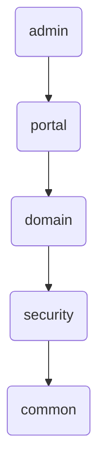
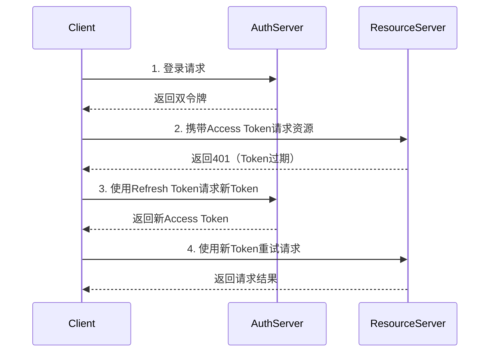

# hotShop

电商秒杀平台 hotShop

## `API接口文档`

`https://apifox.com/apidoc/shared-00464c6c-6131-409a-8dc2-6f63cee93024`

## `CRUD`
- User
- Product
- Order

## `技术架构`

springboot mysql  mybatis

嵌入springSecurity JWT

### 模块化

### 采取双令牌机制，自动刷新令牌

### 安全认证

## `业务架构`
