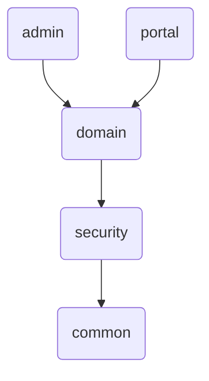
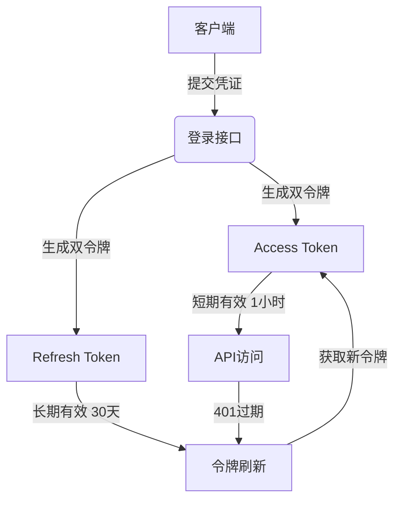
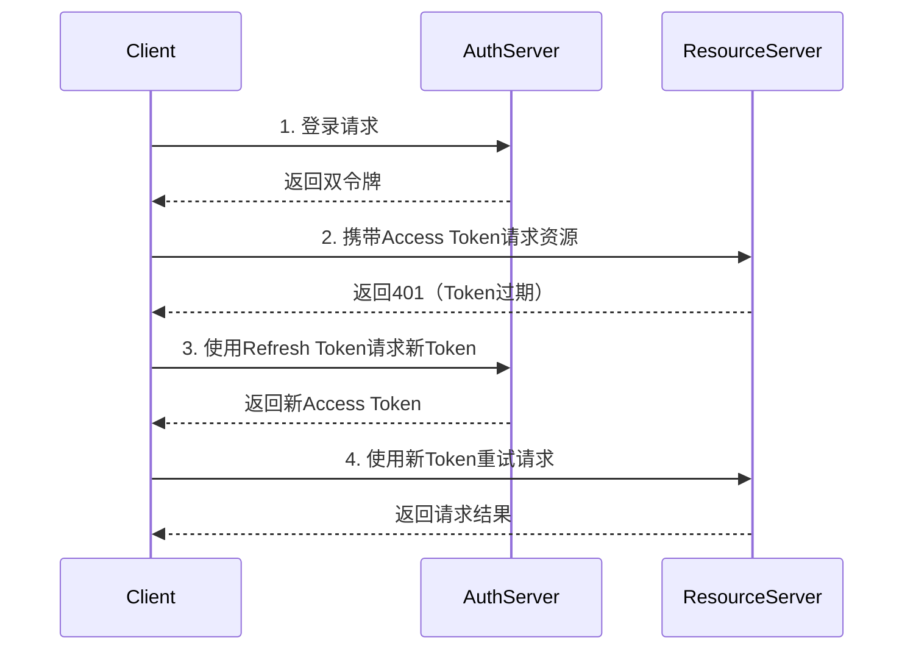

# 📂 双一级标题交互式目录

<details>
<summary><a href="#hotshop-文档">📦 hotShop 文档</a></summary>

- <a href="#1-api接口文档">📘 1. API接口文档</a>
- <a href="#2-crud">📚 2. CRUD模块</a>
- <a href="#3-技术架构">🛠️ 3. 技术架构</a>
     - <a href="#31-模块化">🔩 3.1 模块化</a>
     - <a href="#32-双令牌机制">🔐 3.2 双令牌机制</a>
     - <a href="#33-安全认证">🔒 3.3 安全认证</a>
</details>

<details>
<summary><a href="#4-部署docker">🚢 部署docker</a></summary>

- <a href="#41-docker安装及配置">📦 4.1 Docker安装配置</a>
- <a href="#42-构建和运行-docker-服务">⚙️ 4.2 服务构建运行</a>
- <a href="#43-验证部署">✅ 4.3 部署验证</a>
- <a href="#44-维护和更新">🔄 4.4 维护更新</a>
</details>

# hotShop 文档

电商秒杀平台 hotShop

## 1. API接口文档

`https://apifox.com/apidoc/shared-00464c6c-6131-409a-8dc2-6f63cee93024`

## 2. CRUD
- User
- Product
- Order

## 3. 技术架构

|      技术栈       | 说明                   | 详细                                     | 状态  |
|:--------------:|:---------------------|:---------------------------------------|:---:|
|   SpringBoot   | 用于快速开发 Spring 应用的框架  | 略                                      | 已集成 |
|     Lombok     | 减少 boilerplate 代码的工具 | 略                                      | 已集成 |
|     MySql      | 关系型数据库,用于数据存储        | 存储信息表,用户、订单、商品等                        | 已集成 |
|    MyBatis     | 持久层框架,简化数据库操作        | 略                                      | 已集成 |
|    Swagger     | 用于生成和展示 API 文档的工具    | 略                                      | 已集成 |
| SpringSecurity | 安全框架,用于实现认证和授权       | 用于管理端、用户端的安全认证,拦截请求等操作                 | 已集成 |
|      JWT       | 用于生成和验证 JWT 令牌       | 用于生成定时过期的认证令牌(访问令牌、刷新令牌),服务器无需储存令牌即可验证 | 已集成 |
|     Redis      | 高性能的内存数据库            | 用于设置令牌黑名单,登出的账号的令牌会存储在redis黑名单中        | 已集成 |

### 3.1 模块化

### 3.2 双令牌机制
    使用redis来储存黑名单，减少拦截验证令牌的数据库开销

### 3.3 安全认证


## 4. 业务架构

# 部署docker

## 1. Docker 安装及配置
### 1.1 环境准备
    - 确保虚拟机或服务器满足以下要求：
        - 操作系统：龙蜥8.9 (Anolis8.9)
        - 内存：至少 2GB
        - 磁盘空间：至少 50GB

### 1.2 安装 Docker
   - 更新系统包
     ```bash
     sudo yum update -y
     ```
   - 确保删除原有的依赖包
     ```bash
     sudo yum remove docker \
     docker-client \
     docker-client-latest \
     docker-common \
     docker-latest \
     docker-latest-logrotate \
     docker-logrotate \
     docker-engine
     ```
   - 安装底层工具
     ```bash
     yum install -y yum-utils device-mapper-persistent-data lvm2
     ```  
   - 添加 Docker 的镜像
     ```bash
     自行添加
     ```
   - 安装 Docker
     ```bash
     yum -y install docker-ce docker-ce-cli containerd.io --allowerasing
     ```
   - 验证 Docker 安装
     ```bash
     docker --version
     ```
     应显示 Docker 的版本信息，例如 :
     ```
     Docker version 26.1.3, build b72abbb
     ```
   - 启动 Docker 服务
     ```bash
     sudo systemctl start docker
     ```
   - 设置 Docker 开机自启
     ```bash
     sudo systemctl enable docker
     ```
### 1.3 安装 Docker Compose
   - 下载docker-compose文件
     ```bash
     sudo curl -L https://github.com/docker/compose/releases/download/v2.21.0/docker-compose-`uname -s`-`uname -m` -o /usr/local/bin/docker-compose
     ```
   - 添加执行权限
     ```bash
     sudo chmod +x /usr/local/bin/docker-compose
     ```
   - 验证安装
     ```bash
     docker-compose --version
     ```
     应显示 docker-compose 的版本信息,例如 :
     ```bash
     Docker Compose version v2.21.0
     ```
### 1.4 安装maven和JDK
   - 安装并配置 OpenJDK 17
      ```bash
      sudo yum install java-17-openjdk java-17-openjdk-devel
      sudo alternatives --config java
      sudo nano ~/.bashrc
      export JAVA_HOME=/usr/lib/jvm/java-17-openjdk
      export PATH=$JAVA_HOME/bin:$PATH
      source ~/.bashrc
      java -version
      ```
   - 安装并配置 maven 3.99
      ```bash
      wget https://archive.apache.org/dist/maven/maven-3/3.9.9/binaries/apache-maven-3.9.9-bin.tar.gz
      tar -zxvf apache-maven-3.9.9-bin.tar.gz
      export MAVEN_HOME=/path/to/apache-maven-3.6.3
      export PATH=$MAVEN_HOME/bin:$PATH
      mvn -v
      ```
## 2 构建和运行 Docker 服务

### 2.1 传输项目文件
   - 将本地项目文件传输到虚拟机 :
      
     项目文件在linux下请跳过这步
     ```bash
     scp -r /path/hotShop 用户名@虚拟机IP地址:/opt
     ```

### 2.2 快速启动
   - 在文件目录下运行script中的run.sh :
     ```bash
     # 授予运行权限
     chmod +x run.sh
     ./run.sh
     ```
### 2.3 脚本启动
   - 在当前目录下运行script中的deploy.sh :
     ```bash
     # 授予运行权限
     chmod +x deploy.sh
     ./deploy.sh -h
     ```
|     功能      | 命令                                 | 说明              |
|:-----------:|:-----------------------------------|:----------------|
|    查看帮助     | `./deploy.sh -h`                   | 查看脚本使用帮助        | 
|    构建项目     | `./deploy.sh -a bulid`             | 构建项目,创建jar包     | 
|   启动开发环境    | `./deploy.sh -a start`             | 默认启动所有服务        | 
| 查看admin服务日志 | `./deploy.sh -a logs -s admin`     | 实时查看指定服务日志      |
| 重建portal服务  | `./deploy.sh -a rebuild -s portal` | 强制重建单个服务        |
|   清理所有资源    | `./deploy.sh -a clean`             | 清理Docker资源和构建文件 |
### 2.4 自行启动
   - 构建并启动服务
     ```bash
     # 进入项目根目录
     cd /opt/hotshop
      
     # 清理并打包所有模块
     mvn clean package -DskipTests
      
     # 确认 portal、admin模块的 JAR 文件存在
     ls portal/target/*.jar
     ls admin/target/*.jar
     ```
     应输出以下内容 :
     ```bash
     portal/target/portal-0.0.1-SNAPSHOT.jar
     admin/target/admin-0.0.1-SNAPSHOT.jar
     ```
   - 构建镜像并启动
     ```bash
     #如果有残留请执行以下命令
     #docker-compose down
     #docker system prune -a --volumes
      
     docker-compose build --no-cache
      
     docker-compose up -d
     ```
   - 查看服务状态
     ```bash
     docker-compose ps
     ```
     应输出以下内容 :
     ```bash
     NAME             IMAGE                    COMMAND                               SERVICE          CREATED         STATUS                   PORTS
     hotShop-admin    hotshop-admin-service    "java -jar /app.jar"                  admin-service    9 seconds ago   Up 2 seconds             0.0.0.0:8088->8088/tcp, :::8088->8088/tcp
     hotShop-mysql    mysql:8.0                "docker-entrypoint.sh mysqld"         mysql            9 seconds ago   Up 8 seconds (healthy)   33060/tcp, 0.0.0.0:4306->3306/tcp, :::4306->3306/tcp
     hotShop-portal   hotshop-portal-service   "java -jar /app.jar"                  portal-service   9 seconds ago   Up 2 seconds             0.0.0.0:8080->8080/tcp, :::8080->8080/tcp
     hotShop-redis    redis:alpine             "docker-entrypoint.sh redis-server"   redis            9 seconds ago   Up 8 seconds (healthy)   0.0.0.0:7379->6379/tcp, :::7379->6379/tcp
     ```

## 3 验证部署
   - 访问应用的前端界面或 API,确保其正常工作。
   - {虚拟机ip}:8080/swagger-ui/index.html
   - {虚拟机ip}:8088/swagger-ui/index.html

## 4 维护和更新
   - 开始服务、停止服务、查看服务实时日志
     ```bash
     docker-compose start
     docker-compose stop
     docker-compose logs -f admin-service #or portal-service
     ```
   - 初始化或重新部署服务
     ```bash
     docker-compose up -d
     #or
     docker-compose up #将打印控制台信息
     ```
   - 删除服务
     ```bash
     docker-compose down -v
     ```
   