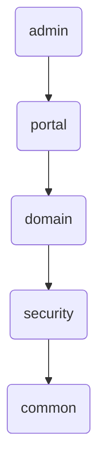
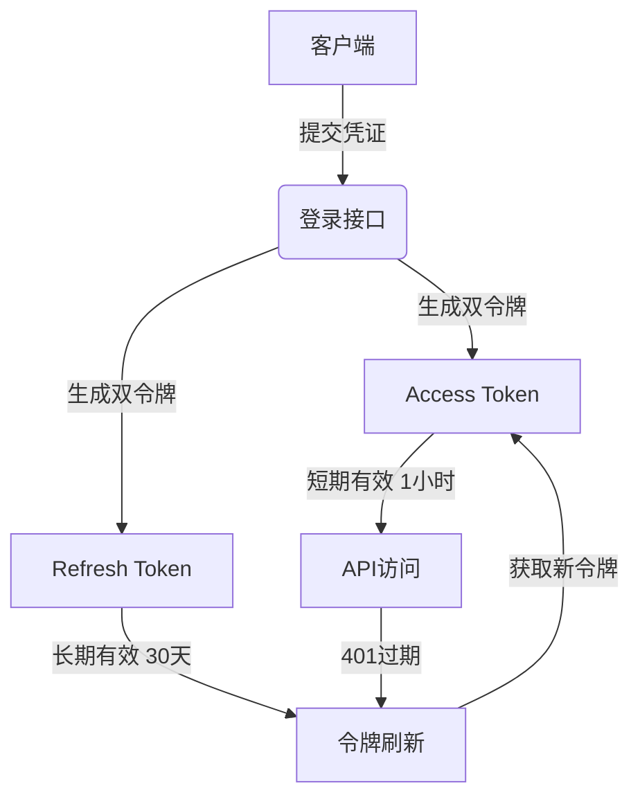
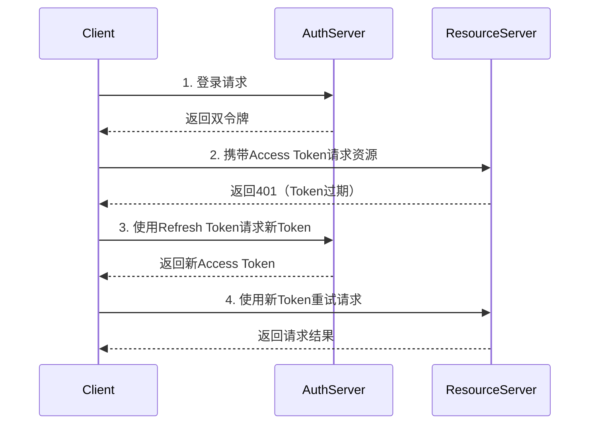

# hotShop

电商秒杀平台 hotShop

## `API接口文档`

`https://apifox.com/apidoc/shared-00464c6c-6131-409a-8dc2-6f63cee93024`

## `CRUD`
- User
- Product
- Order

## `技术架构`

|      技术栈       | 说明                   | 详细                                     | 状态  |
|:--------------:|:---------------------|:---------------------------------------|:---:|
|   SpringBoot   | 用于快速开发 Spring 应用的框架  | 略                                      | 已集成 |
|     Lombok     | 减少 boilerplate 代码的工具 | 略                                      | 已集成 |
|     MySql      | 关系型数据库,用于数据存储        | 存储信息表,用户、订单、商品等                        | 已集成 |
|    MyBatis     | 持久层框架,简化数据库操作        | 略                                      | 已集成 |
|    Swagger     | 用于生成和展示 API 文档的工具    | 略                                      | 已集成 |
| SpringSecurity | 安全框架,用于实现认证和授权       | 用于管理端、用户端的安全认证,拦截请求等操作                 | 已集成 |
|      JWT       | 用于生成和验证 JWT 令牌       | 用于生成定时过期的认证令牌(访问令牌、刷新令牌),服务器无需储存令牌即可验证 | 已集成 |
|     Redis      | 高性能的内存数据库            | 用于设置令牌黑名单,登出的账号的令牌会存储在redis黑名单中        | 已集成 |

 

### 模块化

### 采取双令牌机制，自动刷新令牌
    使用redis来储存黑名单，减少拦截验证令牌的数据库开销

### 安全认证

## `业务架构`
