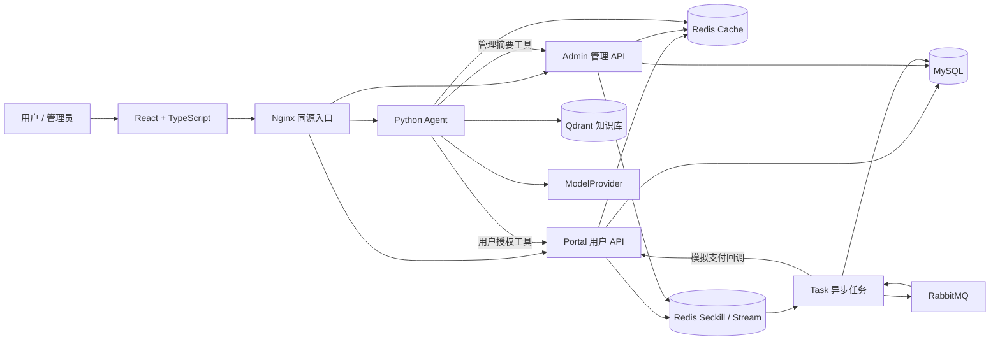
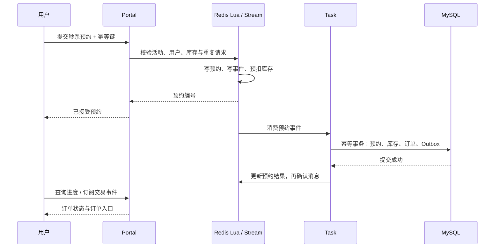
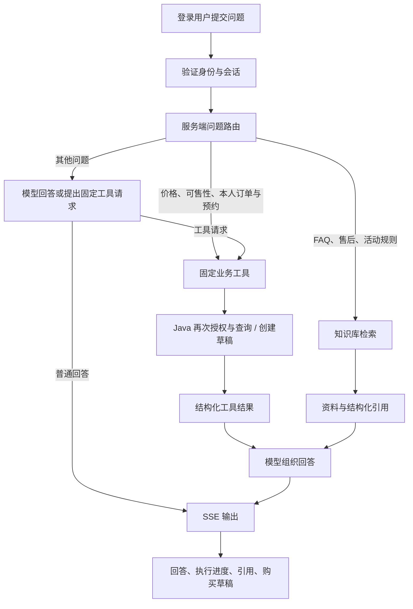
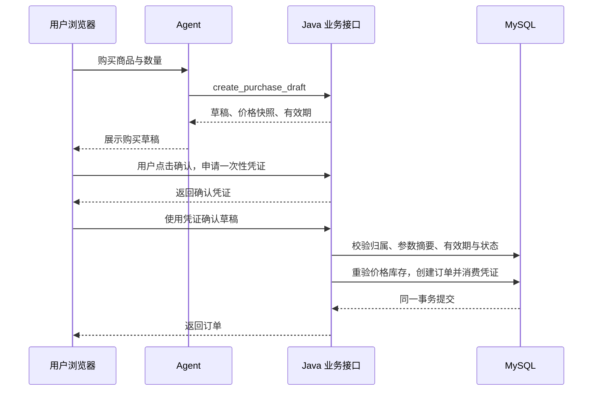

[](https://github.com/LBBZ/hotShop/actions/workflows/ci.yml)

# HotShop

**集成 AI 购物助手的商城交易系统。**

HotShop 围绕商品浏览、普通购买、秒杀预约、订单支付和后台运营构建完整业务流程，并通过 Agent 提供自然语言商品查询、商品对比、购买草稿和知识库问答。用户可以在同一个应用中完成购物、观察异步订单进度、体验 AI 辅助下单，也可以进入管理端查看运营统计与异常摘要。

项目的设计重点是三件事：**用原子预约承接秒杀请求，用事务与幂等保证订单处理，用明确的权限和确认流程把 AI 接入真实业务。**

## 功能概览

| 场景 | 功能 |
| --- | --- |
| 用户购物 | 注册登录、商品搜索、活动浏览、普通下单、本人订单与预约查询 |
| 秒杀交易 | 一人一单、库存预扣、异步建单、失败恢复、订单进度推送 |
| 支付流程 | 模拟支付成功、失败、重复及延迟回调，超时关单与库存恢复 |
| 运营管理 | 商品维护、库存调整、活动装载、异常查询、操作审计与人工消息重放 |
| 用户 Agent | 商品查询与对比、本人订单和预约查询、购买草稿、用户确认下单 |
| 管理 Agent | 运营统计、异常摘要、低风险配置草稿 |
| 知识库问答 | FAQ、售后政策、活动规则检索，附带资料来源与版本 |

## 整体架构

系统采用**单仓库、模块化、多进程架构**。React 提供用户端和管理端，Java 承担交易与后台业务，Python Agent 通过固定 HTTP 接口访问业务能力。Java 业务进程共享领域模块和 MySQL，在单库事务内维护核心交易事实。


```mermaid
flowchart LR
    User[用户 / 管理员] --> Web[React + TypeScript]
    Web --> Nginx[Nginx 同源入口]
    Nginx --> Portal[Portal 用户 API]
    Nginx --> Admin[Admin 管理 API]
    Nginx --> Agent[Python Agent]
    Portal --> DB[(MySQL)]
    Admin --> DB
    Task[Task 异步任务] --> DB
    Portal --> Cache[(Redis Cache)]
    Admin --> Cache
    Agent --> Cache
    Portal --> Seckill[(Redis Seckill / Stream)]
    Admin --> Seckill
    Seckill --> Task
    Task --> MQ[RabbitMQ]
    MQ --> Task
    Task -->|模拟支付回调| Portal
    Agent -->|用户授权工具| Portal
    Agent -->|管理摘要工具| Admin
    Agent --> Knowledge[(Qdrant 知识库)]
    Agent --> Model[ModelProvider]
```

### 进程与模块分工

| 模块 | 职责 | 设计目的 |
| --- | --- | --- |
| `portal` | 用户认证、商品与活动查询、订单与支付、SSE | 集中处理用户请求与资源归属校验 |
| `admin` | 商品维护、库存调整、活动管理、审计 | 将后台操作置于独立授权边界 |
| `task` | Stream 转单、Outbox 发布、超时处理、补偿与对账 | 将可异步处理的工作移出请求链路 |
| `domain` | 库存、订单、支付、消息和 Agent 工具业务逻辑 | 让普通下单与 Agent 确认复用交易规则 |
| `security` | JWT、Refresh、权限与 Agent 委托 | 统一身份验证，区分用户、管理员和委托凭据 |
| `common` / `infrastructure` | 共享契约、Redis、消息拓扑和观测配置 | 复用基础能力，保持接口与错误语义一致 |
| `database` | Flyway 数据库迁移 | 以版本化脚本维护表结构与约束 |
| `agent` | 问题路由、工具编排、知识检索、模型流式输出 | 将模型调用与交易执行分开管理 |
| `web` | 用户页面、管理页面、Agent 工作区 | 提供统一的业务体验与操作反馈 |

这样的组织方式保留了领域代码复用和本地事务的直接性，同时允许 API、异步任务和模型调用在不同进程运行。Agent 或模型不可用时，用户仍可通过普通页面浏览商品、下单和查询订单。

### 技术栈

| 层次 | 技术 |
| --- | --- |
| 前端 | React 19、TypeScript、Vite、pnpm、Nginx |
| 交易与后台 | Java 21、Spring Boot 3.5、Spring Security、MyBatis |
| 数据与缓存 | MySQL 8、Flyway、两个独立 Redis 实例 |
| 异步处理 | Redis Lua / Stream、RabbitMQ、Transactional Outbox |
| AI | Python 3.12、FastAPI、LangGraph、Qdrant |
| 部署与观测 | Docker Compose、Prometheus、Grafana、Loki、Tempo、Alloy |

## 交易链路与设计思路

### 1. 普通购买与秒杀预约采用不同路径

普通购买直接进入 MySQL 事务，校验商品与实时价格、条件扣减库存，并写入订单、订单项和 Outbox。事务提交后，用户拿到待支付订单。

秒杀将入口处理分成“接受预约”和“生成订单”两个阶段。Redis Lua 在一次执行中完成活动校验、一人一单检查、幂等判断、预约记录、库存预扣和 Stream 事件写入；接口返回预约编号，Task 随后消费事件并创建数据库订单。这让秒杀入口主要处理有界的 Redis 操作，将订单持久化交给异步消费者。


```mermaid
sequenceDiagram
    participant U as 用户
    participant P as Portal
    participant R as Redis Lua / Stream
    participant T as Task
    participant D as MySQL
    U->>P: 提交秒杀预约 + 幂等键
    P->>R: 校验活动、用户、库存与重复请求
    R->>R: 写预约、写事件、预扣库存
    R-->>P: 预约编号
    P-->>U: 已接受预约
    R->>T: 消费预约事件
    T->>D: 幂等事务：预约、库存、订单、Outbox
    D-->>T: 提交成功
    T->>R: 更新预约结果，再确认消息
    U->>P: 查询进度 / 订阅交易事件
    P-->>U: 订单状态与订单入口
```

这里将 `Reservation` 与 `Order` 作为两个明确概念：预约表示请求已被接受，订单表示交易已在数据库落地。前端据此展示处理中和建单完成，避免将异步提交成功误显示为购买成功。

### 2. 两个 Redis 实例对应两种数据生命周期

`redis-cache` 保存缓存、限流及安全临时状态，使用可淘汰策略；`redis-seckill` 保存库存预约、幂等结果和待消费事件，使用 `noeviction`、AOF 与 RDB。

采用独立实例，是因为缓存数据和预约数据对内存淘汰的要求不同。隔离后，普通缓存增长不会按缓存淘汰规则挤掉秒杀预约和待处理事件，两类数据也可以分别配置资源和持久化策略。

### 3. Redis Stream 与 RabbitMQ 按业务阶段分工

Stream 紧邻预约入口：Lua 可以在写入预约的同一次执行中写入事件，减少“预约已接受、后续任务却未记录”的窗口。Task 使用消费者组处理消息，并通过 Pending 认领恢复中断的任务。

RabbitMQ 承接数据库事务之后的业务事件、模拟支付回调和超时消息。订单到期处理使用 TTL 与死信路由，消息发布由 Outbox 驱动。二者分别服务于**预约接入**和**交易后续处理**，消息消费均围绕幂等与失败恢复设计。

### 4. 用 Outbox 和幂等处理跨系统失败

订单写入与消息发送涉及 MySQL 和 RabbitMQ。系统先在同一个数据库事务中提交业务记录和 Outbox，再由 Task 发布消息；收到 broker 确认且没有不可路由返回后，才将事件标记为已发布。

如果发布成功后进程退出，事件可能再次投递，因此消费端继续做业务去重：

- 秒杀转单使用事件处理账本、唯一约束和确定性业务标识，避免重复建单和重复扣库存。
- 超时消费将去重记录与关单业务效果放入同一个事务，提交后确认消息。
- 模拟支付回调通过回调账本和条件状态更新处理重复通知。
- Stream 消费在数据库提交、Redis 预约结果更新完成后才执行 `XACK`，中途失败可继续恢复。

整体采用**至少一次投递 + 幂等业务处理**。失败事件可进入重试、补偿或人工处理路径，并保留审计与对账线索。

### 5. 用状态机处理支付与超时竞争

订单状态以 `PENDING → PAID / CANCELED` 为主线。支付成功和超时关闭可能并发发生，后端通过事务锁和条件状态更新决定有效迁移；超时关闭同时恢复库存，迟到的成功回调记录对应支付状态。

支付模块使用 Mock 通道，可以演示成功、失败、重复通知、延迟回调和超时竞态。这些场景复用订单状态机与消息处理链路。

### 6. 管理操作保留并发语义

商品名称、描述等元数据编辑与库存调整使用独立操作。修改描述时不会提交页面上可能过期的库存值；库存调整提交增减量、预期版本和原因，版本冲突时提示刷新，成功后记录审计。

系统同时提供库存与预约对账能力，用于定位 Redis、订单和处理账本之间的差异。默认以检查和报告为主，将人工修复作为显式管理操作。

## Agent：把自然语言连接到业务能力

Agent 提供两套工作区：用户侧辅助购物，管理员侧辅助运营。其实现由 **FastAPI 会话接口、LangGraph 策略与工具节点、固定工具注册表、RAG 检索和模型适配层**组成。

### 1. 用户与管理员各自拥有哪些工具

| 身份 | 工具 | 业务能力 |
| --- | --- | --- |
| 用户 | `search_products` | 按关键词搜索商品，支持分页和结果数量限制 |
| 用户 | `get_product` | 查询商品名称、价格、分类、描述及是否可售 |
| 用户 | `compare_products` | 获取多个商品的对比资料 |
| 用户 | `list_my_orders` | 查询当前登录用户的订单 |
| 用户 | `list_my_reservations` | 查询当前登录用户的预约 |
| 用户 | `create_purchase_draft` | 生成待用户确认的购买草稿 |
| 管理员 | `read_statistics` | 汇总在售商品、库存、近 24 小时订单与支付成功订单、有效预约数量 |
| 管理员 | `read_anomaly_summary` | 汇总消息失败、过期订单和预约、零库存商品、支付失败等预定义异常 |
| 管理员 | `create_configuration_draft` | 保存回答风格、摘要窗口、结果数量等低风险配置建议 |

工具由代码静态注册，每个工具声明输入结构、身份、scope、HTTP 方法和固定路径。模型使用严格 JSON 表达工具请求，服务端校验名称与参数后才调用 Java。用户身份从验证后的凭据中取得，本人订单查询不接受模型自行指定用户。

目前每次运行最多执行一个工具，适合单项查询或生成购买草稿；工具结果随后交给模型组织回答。管理配置保留为草稿，实际变更需要另行处理。

### 2. 一次问题如何被处理


```mermaid
flowchart TD
    Input[登录用户提交问题] --> Auth[验证身份与会话]
    Auth --> Route[服务端问题路由]
    Route -->|价格、可售性、本人订单与预约| Tool[固定业务工具]
    Route -->|FAQ、售后、活动规则| RAG[知识库检索]
    Route -->|其他问题| Model[模型回答或提出固定工具请求]
    Model -->|工具请求| Tool
    Tool --> Java[Java 再次授权与查询 / 创建草稿]
    Java --> Result[结构化工具结果]
    Result --> Answer[模型组织回答]
    RAG --> Evidence[资料与结构化引用]
    Evidence --> Answer
    Model -->|普通回答| Stream[SSE 输出]
    Answer --> Stream
    Stream --> UI[回答、执行进度、引用、购买草稿]
```

在启用 RAG 的配置下，服务端先按问题类型路由。已识别的动态事实查询直接进入业务工具，静态问题进入知识检索；其他问题由模型回答或选择允许的工具。LangGraph 应用用户或管理员策略，并通过工具节点执行受控调用。

工具响应使用专门的业务 DTO，结果作为结构化数据提供给模型。前端接收回答片段、工具开始与结束、引用以及购买草稿等事件，让用户看到执行进度和可操作结果。

### 3. 购买草稿与用户确认如何衔接

AI 辅助购买分成**整理购买意图**和**用户授权交易**两个阶段。

草稿包含商品、数量、价格快照、金额和有效期，生成时只做普通查询与草稿持久化。用户核对后点击“确认并创建订单”，浏览器直接请求 Java 签发并消费一次性确认凭证。


```mermaid
sequenceDiagram
    participant U as 用户浏览器
    participant A as Agent
    participant J as Java 业务接口
    participant D as MySQL
    U->>A: 购买商品与数量
    A->>J: create_purchase_draft
    J-->>A: 草稿、价格快照、有效期
    A-->>U: 展示购买草稿
    U->>J: 用户点击确认，申请一次性凭证
    J-->>U: 返回确认凭证
    U->>J: 使用凭证确认草稿
    J->>D: 校验归属、参数摘要、有效期与状态
    J->>D: 重验价格库存，创建订单并消费凭证
    D-->>J: 同一事务提交
    J-->>U: 返回订单
```

确认凭证绑定用户、草稿、动作和商品数量摘要，数据库只保存哈希。消费时通过行锁与状态更新防止重复使用，凭证消费和订单创建在同一事务中提交；建单失败则一起回滚。

这使自然语言输入可以转化为可核对的购买意图，而最终订单仍经过现有交易规则。确认凭证只在浏览器与 Java 之间传递，不进入模型上下文或 Agent 事件流。

### 4. RAG 如何区分静态知识与实时业务

知识库保存 FAQ、售后政策和静态活动规则，价格、可售性、订单及预约状态由 Java 业务工具读取。这个划分对应两类不同的数据更新方式：规则适合维护文档和版本，交易状态需要请求时查询。

检索流程包括问题向量化、Qdrant 搜索、分数筛选和证据组织。服务端根据已验证身份构造租户、可见性、文档类型与有效期过滤条件，再将资料提供给模型。检索资料被标记为不可信证据，RAG 分支禁止调用工具，避免文档内容变成业务操作指令。

回答附带文档标题、来源、版本及片段标识。没有可靠命中或检索服务不可用时，返回明确提示。知识源位于 `agent/knowledge`；重建索引时先写入完整的版本化集合，校验完成后原子切换别名，让查询继续使用完整索引。

### 5. 模型与向量模型分别适配

`ModelProvider` 统一聊天模型的流式回答、工具请求和用量信息，支持 FakeModel、DeepSeek 和通义千问。业务编排通过统一接口调用模型，厂商配置集中在适配层，由启动配置选择当前 Provider。

`EmbeddingProvider` 独立负责文档和查询向量化，支持 deterministic 与百炼 Embedding。聊天模型与向量模型可以分别配置；更换向量模型或维度时需要重建知识索引。

本地演示默认使用 FakeModel 和 deterministic Embedding，便于直接启动并复现业务流程；体验真实模型问答可按 [Agent 运行手册](docs/runbooks/agent-service.md)配置 DeepSeek 或通义千问。

### 6. 权限与运行生命周期

用户、管理员、Agent Delegation 使用分开的凭据边界。用户 Agent 通过 Token exchange 获得最长五分钟、不可刷新的委托凭据，工具调用在 Python 和 Java 两侧分别校验权限。购买确认始终使用用户身份；管理 Agent 只注册统计、异常摘要和配置草稿工具。

会话与消息通过 Redis 保存短期状态，运行任务由 Agent 进程管理。SSE 支持流式回答和取消，模型调用外围提供超时、有限重试、熔断以及全局和按用户并发限制。客户端断开或取消时会释放模型流和并发额度，有界事件队列控制慢客户端产生的缓存增长。

当前交互以单次任务为单位：前端每次提交创建会话，模型输入围绕当前问题构建。运行指标记录用量、耗时和结果，工具及确认操作记录审计，便于追踪一次请求经过了哪些业务边界。

## 本地启动

需要 PowerShell 7、Docker Desktop Linux containers 和 Docker Compose 2.24.4+。在仓库根目录执行：

```powershell
pwsh -NoProfile -File ./script/task21-demo.ps1 -Action Start
```

启动脚本会生成独立配置和密钥，构建服务、执行数据库迁移、导入演示商品、建立知识索引并装载活动。首次构建需要下载依赖，完成后访问 [本地商城](http://127.0.0.1:18080)。若端口占用，可增加 `-WebPort 18081`。

| 入口 | 使用方式 |
| --- | --- |
| 商城首页 | 浏览商品和活动，注册个人用户后体验交易 |
| `/user/agent` | 登录用户使用购物助手 |
| `/admin/agent` | 管理员使用运营助手 |
| 管理员演示账号 | `task13-admin` / `Task13Admin!2026` |

记下脚本输出的项目名，后续恢复使用 `Restart`，已有数据会保留：

```powershell
# 将示例值替换为首次启动输出的 Demo project
$demoProject = 'hotshop-task21-example01'
pwsh -NoProfile -File ./script/task21-demo.ps1 -Action Status -ProjectName $demoProject
pwsh -NoProfile -File ./script/task21-demo.ps1 -Action Stop -ProjectName $demoProject
pwsh -NoProfile -File ./script/task21-demo.ps1 -Action Restart -ProjectName $demoProject
```

演示活动从首次初始化起有效一天，恢复环境不会重置库存或延长活动。需要新一轮演示数据时，重新执行 `Start` 创建独立环境。更多配置见[容器运行手册](docs/runbooks/container-environment.md)。

## 推荐演示顺序

1. **完整购物流程**：浏览商品、注册登录、普通下单、模拟支付，查看订单时间线。
2. **异步秒杀流程**：提交活动预约，观察预约到订单的状态变化，结合架构图讲解 Lua、Stream 和 Task 的分工。
3. **用户 Agent**：输入“商品 913001 多少钱”，再提出购买需求，核对草稿后点击确认并进入订单。
4. **知识库问答**：输入“售后申请应从哪里发起？”，展示回答及资料引用，说明静态知识与实时查询的区别。
5. **管理 Agent 与后台**：查询运营概览和异常摘要，再展示显式库存调整、版本冲突与审计记录。

## 深入阅读

| 主题 | 文档 |
| --- | --- |
| 架构与领域 | [系统架构](docs/architecture/current-state.md) · [数据库设计](docs/architecture/database-schema.md) · [架构决策](docs/architecture/adr/ADR-002-modular-processes.md) |
| 交易一致性 | [秒杀预约](docs/architecture/flash-sale-reservation.md) · [异步建单](docs/architecture/stream-order-processing.md) · [可靠消息](docs/architecture/reliable-messaging.md) · [模拟支付](docs/architecture/mock-payment.md) |
| Agent 实现 | [进程与运行生命周期](docs/architecture/agent-process.md) · [工具与购买确认](docs/architecture/agent-tools-and-confirmation.md) · [RAG 设计](docs/architecture/agent-rag.md) · [模型适配](docs/architecture/adr/ADR-001-multi-model-provider.md) |
| 部署与维护 | [容器环境](docs/runbooks/container-environment.md) · [身份认证](docs/runbooks/authentication-operations.md) · [知识库维护](docs/runbooks/agent-rag.md) · [可观测性](docs/architecture/observability.md) |
| 演示与验证 | [演示操作](docs/delivery/demo.md) · [测试记录](docs/quality/evidence-index.md) · [性能测试报告](docs/quality/task-20-performance.md) |
