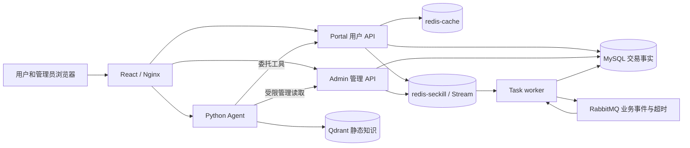

[](https://github.com/LBBZ/hotShop/actions/workflows/ci.yml)

# HotShop

用于学习与面试展示的本地商城交易项目：React 用户端与管理端、Java 交易核心、Python Agent。
重点展示库存并发、异步预约、消息重试、模拟支付、委托权限与可复核的工程证据。
这是**模块化、多进程项目**，共享 MySQL；没有线上运营或稳定高 QPS 的证明。

**交付状态：部分完成。** 本轮真实浏览器已发现审计列表阻塞与中文RAG召回限制，英文引用已通过，失败测试保留；
参见[阻塞报告](docs/quality/task-21-blockers.md)。下列功能描述表示源码能力，不代表整体验收通过。

## 实际功能

- 匿名浏览、搜索商品和活动；注册、登录、本人订单与预约进度。
- 普通购买；Redis Lua 预约秒杀，Stream worker 异步建单；订单时间线通过 SSE 更新。
- 明确标为 Mock 的支付成功、失败、重复、延迟回调和超时竞态演示，不转移资金。
- 后台商品元数据编辑、显式库存增减、版本冲突提示、活动装载、异常查询、审计和人工 Outbox 重放。
- 用户 Agent 实时查询商品/本人订单、生成购买草稿；用户点击确认后才由 Java 创建订单。
- 管理 Agent 只读分析和配置草稿；退款、库存补偿、Outbox 重放、封禁及权限/密钥修改不开放给 Agent。
- Qdrant 静态 FAQ/售后/活动规则引用；实时价格、库存、订单由授权工具读取。

## 技术栈与架构

| 层 | 仓库固定配置 |
| --- | --- |
| Java | Java 21、Spring Boot 3.5.16、MyBatis 3.0.5、Maven Wrapper 3.9.16 |
| 数据 | MySQL 8.0.46、Flyway 11.20.3，无数据库外键 |
| 消息/缓存 | 两个 Redis 8.8.1 实例（均 DB 0）、RabbitMQ 4.2.9 management，TTL + DLX |
| Web | React 19.1.1、TypeScript 5.9.2、Vite 7.3.5、pnpm 10.15.0、Playwright 1.57.0 |
| Agent | Python 3.12.14、FastAPI、LangGraph，依赖见 agent/requirements.lock；Qdrant 1.15.4 |
| 观测 | 可选 Compose observability profile：Prometheus、Grafana、Loki、Tempo、Alloy |

版本事实来源：[pom.xml](pom.xml)、[Compose](docker-compose.yml)、[Agent Dockerfile](agent/Dockerfile)、
[Web package.json](web/package.json)。镜像 tag/digest 与语言依赖按仓库锁定配置构建。


```mermaid
flowchart LR
    U[用户和管理员浏览器] --> W[React / Nginx]
    W --> P[Portal 用户 API]
    W --> A[Admin 管理 API]
    W --> G[Python Agent]
    G -->|委托工具| P
    G -->|受限管理读取| A
    G --> Q[(Qdrant 静态知识)]
    P --> DB[(MySQL 交易事实)]
    A --> DB
    P --> RC[(redis-cache)]
    P --> RS[(redis-seckill / Stream)]
    A --> RS
    RS --> T[Task worker]
    T --> DB
    T --> MQ[RabbitMQ 业务事件与超时]
    MQ --> T
```

Java 共享模块为 common、infrastructure、domain、database、security，运行进程为 portal、admin、task。
完整的状态、权限与消息图见[架构入口](docs/architecture/current-state.md)。

### 关键边界

- Access 使用 RS256 JWT，User/Admin 默认 15 分钟，委托默认 5 分钟。Refresh 是随机不透明令牌，
  默认 7 天；MySQL 只存哈希，以行锁轮换，检测复用并撤销 family。Refresh Cookie 为 HttpOnly、
  SameSite=Strict，refresh/logout 校验 CSRF；本地 HTTP 显式关闭 Secure。浏览器 Access 只放内存。
  详见[认证运行手册](docs/runbooks/authentication-operations.md)。
- `redis-cache` 是可重建缓存/限流/安全临时状态，allkeys-lfu；`redis-seckill` 保存预约、幂等和 Stream，
  noeviction、AOF everysec + RDB。没有按 dbIndex 动态创建连接工厂的机制。
- 消息语义是**至少一次投递 + 业务幂等效果**。Stream 处理预约建单；RabbitMQ 承接后续事件及超时。
  MySQL 事务写 Outbox；confirm/returns、Inbox/唯一键和状态条件更新共同处理重投，不承诺 exactly-once。
- 元数据编辑不提交库存。库存调整提交 delta、expectedVersion、reason；合法扣减/回补/调整同时维护
  stock、expected_stock 和 version。expected_stock 是迁移/创建时建立的预期余额，不是完整历史事件账本。
  有界对账使用游标、fence 和预占号去重；持续写入可使全轮扫描一直 IN_PROGRESS，不能当作通过。

## 本地快速启动

**终端：PowerShell 7；工作目录：本仓库根目录。** 以下示例使用任务独立 worktree。
需要 Git、可用的 Docker Desktop Linux containers（或等价 Engine）、Compose 2.24.4+ 和浏览器。
Compose overlay 使用 `!override`。容器自带 Java/Python/Node/pnpm，启动不要求宿主安装这些语言工具链。
Docker 需能拉镜像及访问 Maven、PyPI、npm、系统软件源；首次下载与编译可能较久。
本轮实测环境和耗时见[交付报告](docs/quality/task-21-delivery.md)，不是另一台新机器的验证。
给 Docker 预留足够内存和磁盘；本轮 VM 为约 7.62 GiB、32 vCPU，不把这当作最低配置保证。

```powershell
Set-Location D:/Codex/Projects/hotShop-task21
$demoProject = 'hotshop-task21-' + [guid]::NewGuid().ToString('N').Substring(0,12)
pwsh -NoProfile -File ./script/task21-demo.ps1 -Action Start -ProjectName $demoProject
```

若该名字已有资源，脚本拒绝覆盖。新一轮可省略 `-ProjectName` 自动生成，并记下输出名字。
默认打开 [本地演示](http://127.0.0.1:18080)；端口被占用时为 Start 增加 `-WebPort 18081`。
不要同时启动多个占用相同 Web 端口的演示。

启动脚本会生成独立凭据、四组 RSA 密钥，创建全新 Compose project/volume/image tag，运行 Flyway，
构建并启动 Java/Agent/Nginx，导入一次演示数据、重建知识索引，并以管理员 API 装载活动。
所有宿主端口绑定 127.0.0.1，后端端口随机分配。没有必填付费 Key，也不使用既有数据库。
本地密钥/env 位于被忽略的 `.local/keys/<project>/`，不要上传该目录。

- 管理员：`task13-admin` / `Task13Admin!2026`，仅公开的隔离演示账号，来自现有测试 seed。
- 用户：页面进入“注册”，填写新用户名、`@hotshop.invalid` 邮箱及密码。没有隐藏的默认用户账号。
- 商品 `913001`：高热交易收音机；活动同号。Start 将原测试 seed 的有效窗口扩为初始化后一天。
- Start 只允许首次初始化；Restart 不重灌库存、不延长活动。活动过期后使用新的项目名开始一轮。

```powershell
# 同一根目录、同一项目名；停止和恢复均保留数据。
pwsh -NoProfile -File ./script/task21-demo.ps1 -Action Status -ProjectName $demoProject
pwsh -NoProfile -File ./script/task21-demo.ps1 -Action Stop -ProjectName $demoProject
pwsh -NoProfile -File ./script/task21-demo.ps1 -Action Restart -ProjectName $demoProject
```

脚本失败时保留资源和日志，不自动重置数据。配置/日志/端口排查见[容器手册](docs/runbooks/container-environment.md)。
镜像构建中的 `-DskipTests` 仅用于打包，构建成功不能算测试通过。

## 7 分钟核心演示

1. 匿名浏览 → 注册/登录 → 打开商品 → 创建订单，展示 ORDER_CREATED。
2. 在订单 Mock 收银台选择成功，展示 PAID；说明异步 worker 和签名回调，不是真实支付。
3. 返回首页预约秒杀，展示 RESERVED → ORDER_CREATED 与订单链接。
4. 管理员编辑描述；另一用户购买后保存，不覆盖扣减。打开库存调整，再购买，旧版本提交得到 409；
   刷新、核对 delta 后提交，查看审计。
5. 用户 Agent 查询商品，提出购买请求，展示“尚未创建订单”草稿，再点击确认。
6. 查询售后规则，查看静态引用；管理 Agent 请求退款/重放，展示拒绝。另一个用户不能打开前述订单。

逐步操作、预期、讲解及排障：[演示脚本](docs/delivery/demo.md)。真实执行结论与未完成项以交付报告为准。

## 模型与 Embedding 配置

演示强制 `AGENT_MODEL_PROVIDER=fake`、`AGENT_EMBEDDING_PROVIDER=deterministic`。
FakeModel 是可预测工具编排测试替身，不能用它证明真实模型的自然语言能力或生产命中率。
真实模型的只读 registry 支持 `deepseek` 和 `qwen`，每进程一个活动 Provider，无自动跨厂商 fallback。
仓库 DeepSeek 默认模型名 `deepseek-v4-flash`、Qwen 为 `qwen-plus`；这是源码默认值，不代表本轮真实 API 已验证。
真实模型配置只走受信任环境，详见 [ADR-001](docs/architecture/adr/ADR-001-multi-model-provider.md)。
EmbeddingProvider 独立支持 deterministic 与百炼 embedding；切换聊天模型不会自动切换向量模型。
更换 embedding 模型/维度须重建知识索引，见 [RAG 手册](docs/runbooks/agent-rag.md)。

## 测试与复验

所有下列命令从仓库根目录执行，PowerShell 7。先完成上面的独立演示启动。
浏览器测试另需宿主 Node 22+ 和 Corepack；pnpm 固定 10.15.0。

```powershell
corepack pnpm@10.15.0 --dir web install --frozen-lockfile
corepack pnpm@10.15.0 --dir web exec playwright install chromium
corepack pnpm@10.15.0 --dir web exec playwright test --config playwright.delivery.config.ts
corepack pnpm@10.15.0 --dir web test
corepack pnpm@10.15.0 --dir web typecheck
```

交付浏览器测试连接 `http://127.0.0.1:18080` 的真实 Nginx/后端，无路由 mock。
使用其他 Web 端口时先设 `$env:HOTSHOP_DELIVERY_URL='http://127.0.0.1:18081'`。
当前完整交付套件保留审计/RAG的失败断言，运行返回非零；不要把失败项跳过后宣称通过。
测试会创建用户和订单、调整演示库存，只用于上述隔离测试数据。

```powershell
# 宿主 Java 21；Docker 可用供 Testcontainers 创建独立中间件。
./mvnw.cmd -B -ntp verify
# Agent 测试镜像（固定依赖），不调用付费模型。
docker build --target test -t hotshop-task21-agent-tests:local -f agent/Dockerfile agent
docker run --rm --network none --entrypoint python hotshop-task21-agent-tests:local -m pytest -p pytest_asyncio.plugin -p no:cacheprovider -m 'not qdrant'
# 更广的真实浏览器/故障入口；自动创建并回收自己的隔离资源。
pwsh -NoProfile -File ./script/verify-task19-e2e.ps1
```

非 Qdrant Agent 命令不证明真实向量库和容器权限全部通过；跳过/排除以输出为准。
更多命令、对应 SHA、历史结果、fault/security/eval 和 CI 入口见[证据索引](docs/quality/evidence-index.md)。
基线 [CI run 34998695750](https://github.com/LBBZ/hotShop/actions/runs/34998695750) 对应
`10d82528aab71766ab5aa6020180ae4935f96359`；成功范围含 mocked smoke，不是完整浏览器闭环或长期压测。

## 性能结果与局限

[TASK-20 版本化报告](docs/quality/task-20-performance.md) 对应 `550231ab`，不是本轮重新压测。
5000 requested RPS 是施加目标，**未达成容量目标**：10 秒到达窗口、1000 VU，完成/接受预约 2206，
dropped iterations 47791；220.6 是完成量除以到达窗口，含 graceful-stop 尾部完成，不能视为稳定吞吐。
k6 原始执行含 2 秒 warmup 与尾部共 15.8233 秒。预约 HTTP P99 5088.75 ms；异步建单 P99 52094.12 ms。
逐迭代真实登录占用 VU 与 CPU，但登录成本不计入预约 HTTP 延迟。
Rabbit raw ready 4412 是 2206 条无当前消费者的 ORDER_CREATED 集成消息和 2206 条 15 分钟 TTL 消息；
属于报告明确核对的排除边界，不代表队列全空，也不直接等于异常积压。

尚无线上用户规模、商业收益、真实支付、长期稳定高吞吐或全项目终验结论。
本地 C1 JVM、资源上限、确定性模型、静态语料和短时间窗口均限制结论外推。
无外键要求应用事务与唯一/检查约束维护引用一致性；特权 SQL 可绕过部分业务约束。
持续写入下对账可能需要稳定窗口才能完成；余额基线不追溯迁移前差异。
下一轮问题只记录在[优化清单](docs/delivery/next-iteration.md)，本轮不扩展架构或性能实现。

## 文档导航

- [当前架构](docs/architecture/current-state.md) · [数据库](docs/architecture/database-schema.md) · [消息](docs/architecture/reliable-messaging.md)
- [秒杀](docs/architecture/flash-sale-reservation.md) · [Stream 建单](docs/architecture/stream-order-processing.md) · [Mock 支付](docs/architecture/mock-payment.md)
- [Agent 工具确认](docs/architecture/agent-tools-and-confirmation.md) · [静态 RAG](docs/architecture/agent-rag.md)
- [启动与排障](docs/runbooks/container-environment.md) · [认证](docs/runbooks/authentication-operations.md) · [故障演练](docs/runbooks/fault-injection.md)
- [测试证据](docs/quality/evidence-index.md) · [演示](docs/delivery/demo.md) · [双版简历与面试问答](docs/delivery/career.md)
- [TASK-21 验收映射与结果](docs/quality/task-21-delivery.md) · [路线约束](docs/roadmap/MASTER_PLAN.md)
