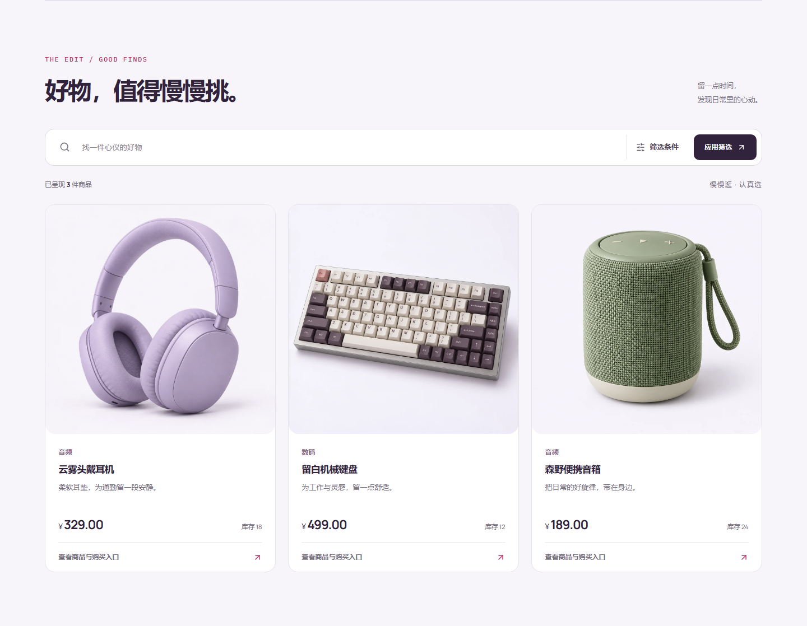
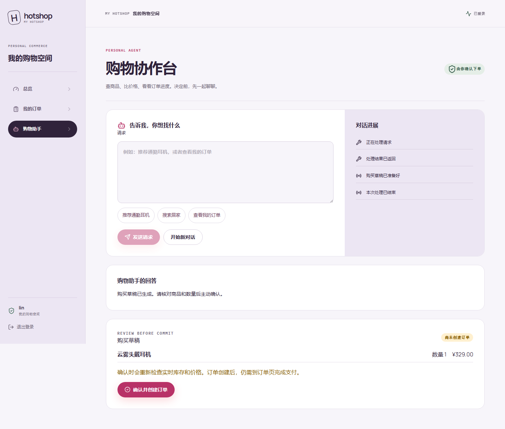
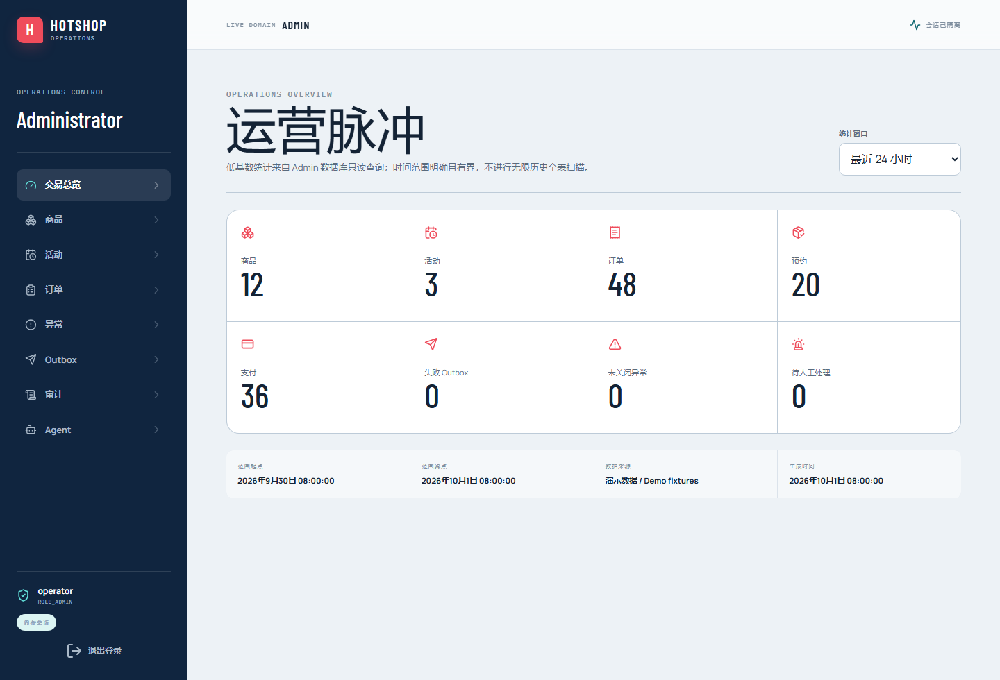

# HotShop

**从商品发现，到 AI 辅助购买，再到交易与运营。**

HotShop 是一个可在本地运行的全栈商城项目。React 商城、Java 交易服务和 Python 购物助手协同工作，覆盖普通购买、限时预约、订单支付与后台管理。

**简体中文** · [English](README.en.md) · [快速开始](#快速开始) · [文档](docs/README.md) · [参与开发](CONTRIBUTING.md)

[](https://github.com/LBBZ/hotShop/actions/workflows/ci.yml)



| AI 购物助手                                                                                  | 运营工作区                                                                                    |
| -------------------------------------------------------------------------------------------- | --------------------------------------------------------------------------------------------- |
| [](docs/assets/assistant.png) | [](docs/assets/operations.png) |
| 查商品、问规则、准备购买草稿，确认后才创建订单。                                             | 管理商品、库存和活动，查看审计与运营摘要。                                                    |

截图来自实际前端，使用固定展示数据；可点击放大。[截图说明与复现](docs/assets/README.md)。

## 可以体验什么

- **完整购物流程** — 商品搜索与筛选、多图放大与规格详情、普通购买、限时活动预约，以及个人订单、支付和预约进度。
- **有确认步骤的 AI 购买** — 商品查询与对比、本人订单查询、带来源的知识问答；购买请求先形成草稿，再由用户确认。
- **独立运营后台** — 商品维护、库存调整、活动装载、操作审计、交易指标与异常摘要。

界面支持手机布局、键盘导航和减少动态效果偏好。演示商品使用明确标注的 AI 生成图片；缺图时回退为品类示意。后台可维护图片地址、替代文本和规格。

## 快速开始

准备好 [Git](https://git-scm.com/downloads)、[Docker](https://docs.docker.com/get-started/get-docker/)（Linux 容器，Compose **2.24.4+**）和 [PowerShell 7.2+](https://learn.microsoft.com/powershell/scripting/install/installing-powershell)。启动 Docker 后执行：

```powershell
git clone https://github.com/LBBZ/hotShop.git
cd hotShop
pwsh -NoProfile -File ./script/demo.ps1 -Action Start
```

本地项目固定为 `hotshop`，每个子服务使用自己的容器和固定镜像名。再次 Start 复用配置和业务数据，只构建缺失或源码已变化的镜像。

首次运行会下载依赖、构建镜像、迁移数据库并初始化演示数据。看到启动成功提示后，打开 **http://127.0.0.1:18080**，注册账号即可进入个人工作区。

默认演示无需模型 API Key：AI 使用预设响应的 **FakeModel**，支付使用 **Mock Provider**。这套配置适合体验业务流程；接入 DeepSeek 或 Qwen 后可使用真实模型。演示数据包含音频、数码、居家、出行 4 类共 8 件虚构商品，以及可预约、售罄、已结束的活动各 1 个。

在 AI 助手中试试 `推荐通勤耳机`，勾选两件商品进行价格与规格对比，再点击「准备购买草稿」。核对并确认后才会创建订单。也可以直接输入 `购买商品 913001 数量 1 件`。管理员登录、知识问答示例、重启与停止命令见[演示指南](docs/delivery/demo.md)。端口占用时，在首次启动命令末尾加 `-WebPort 18081`。

## 值得看看的实现

- **两条交易路径**：普通购买在 MySQL 事务中扣库存、建订单；限时预约通过 Redis Lua 原子预扣库存并写入 Stream，再由异步任务建单，页面区分预约与订单状态。
- **失败后的恢复**：事务 Outbox、RabbitMQ 发布确认与消费者幂等共同处理重复投递；支付超时、库存补偿和对账覆盖失败路径。
- **AI 与业务的连接**：Agent 通过受限 HTTP 工具访问业务，校验身份与资源归属；购买需要一次性确认，模型无法直接支付。

这是一个单仓库、模块化、多进程应用，Java 服务共享领域代码与 MySQL。架构图和流程细节见[当前架构](docs/architecture/current-state.md)与[交易旅程](docs/architecture/user-transaction-journey.md)。

## 技术与代码

| 模块                                       | 技术                                        |
| ------------------------------------------ | ------------------------------------------- |
| [前端](web/README.md)                      | React · TypeScript · Vite · Tailwind CSS    |
| [交易](docs/architecture/current-state.md) | Java 21 · Spring Boot · MyBatis · Flyway    |
| [Agent](docs/runbooks/agent-service.md)    | Python · FastAPI · LangGraph · Qdrant       |
| [数据](docker-compose.yml)                 | MySQL · Redis Lua / Stream · RabbitMQ       |
| [监控](docs/runbooks/observability.md)     | Prometheus · Grafana · Loki · Tempo · Alloy |

依赖版本以 [Maven](pom.xml)、[Web](web/package.json)、[Python](agent/pyproject.toml) 清单和锁文件为准。

## 文档与贡献

- [贡献指南](CONTRIBUTING.md)：开发环境、检查命令与提交约定。
- [API 契约](docs/api/api-contract.md)：用户、管理员及 Agent 的接口边界。
- [CI 与验证](docs/quality/ci.md)：自动化检查及运行方式。
- [文档中心](docs/README.md)：架构、运维、历史报告与[后续工作](docs/delivery/next-iteration.md)。

当前项目面向本地演示和工程实践：Mock 支付不涉及真实结算，Agent 的未完成流式运行不跨进程重启恢复，已有压测不构成生产容量承诺。验证范围见[证据索引](docs/quality/evidence-index.md)。

欢迎通过 [Issues](https://github.com/LBBZ/hotShop/issues) 报告问题或提出改进。
