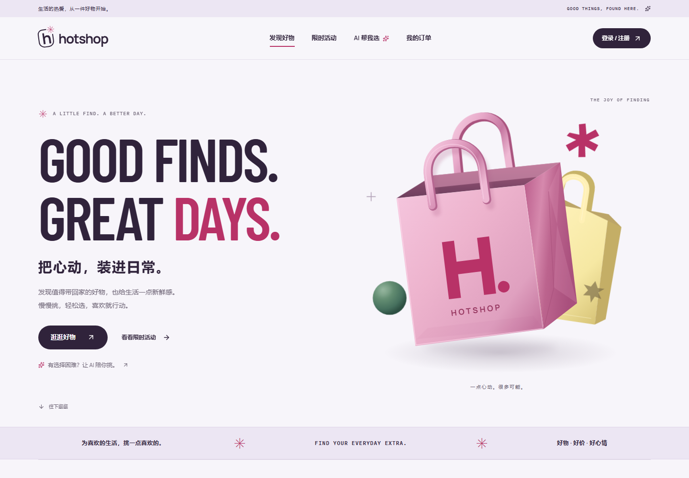
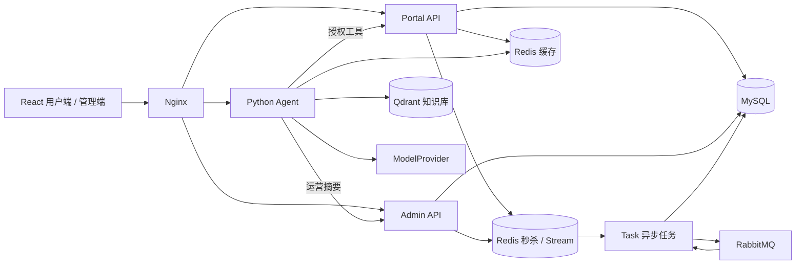

# HotShop

**把心动装进日常。** 一个集成 AI 购物助手的全栈商城，贯通商品发现、限时预约、订单支付和后台运营。

**简体中文** · [English](README.en.md) · [文档中心](docs/README.md) · [快速演示](docs/delivery/demo.md)

[](https://github.com/LBBZ/hotShop/actions/workflows/ci.yml)



## 从发现好物，到确认购买

HotShop 将日常购物和交易系统放在同一个可运行的项目里。用户可以浏览商品、参加限时活动、跟踪订单，也可以让 AI 查商品、做对比、解释规则并准备购买草稿。管理员有独立的商品、库存、活动、审计与运营工作区。

| 场景      | 可以体验的内容                                               |
| --------- | ------------------------------------------------------------ |
| 商品发现  | 搜索、分类筛选、商品详情、普通购买；原创品类插画与响应式页面 |
| 限时活动  | 活动倒计时、库存预约、每个活动一条有效预约、异步订单进度     |
| 我的购物  | 注册登录、个人工作区、订单与预约查询、支付与超时关闭状态     |
| AI 帮我选 | 自然语言商品查询、对比、本人订单查询、带来源的知识问答       |
| 确认购买  | AI 先生成草稿，用户在页面确认后才创建订单                    |
| 后台运营  | 商品维护、显式库存调整、活动装载、操作审计和异常摘要         |

页面支持键盘操作、窄屏布局和减少动态效果偏好。商品接口暂未提供照片，因此卡片使用标注为「品类示意」的插画。

## 快速运行

在仓库根目录运行。需要 **Docker Engine / Docker Desktop（Linux 容器）、Docker Compose 2.24.4+ 和 PowerShell 7+**。首次运行会拉取依赖并构建镜像。

```powershell
pwsh -NoProfile -File ./script/task21-demo.ps1 -Action Start
```

脚本创建独立 Compose 项目、随机凭据和签名密钥，执行数据库迁移，初始化演示商品与限时活动，并建立知识索引。完成后打开 **http://127.0.0.1:18080**，注册用户即可开始购物；管理员入口和演示账号见[演示指南](docs/delivery/demo.md)。默认使用 FakeModel 和 deterministic embedding，无需模型 API Key。

保留终端输出的项目名。以下示例中的名称须替换为实际值：

```powershell
pwsh -NoProfile -File ./script/task21-demo.ps1 -Action Status -ProjectName hotshop-task21-xxxxxxxxxxxx
pwsh -NoProfile -File ./script/task21-demo.ps1 -Action Restart -ProjectName hotshop-task21-xxxxxxxxxxxx
pwsh -NoProfile -File ./script/task21-demo.ps1 -Action Stop -ProjectName hotshop-task21-xxxxxxxxxxxx
```

`Restart` 保留数据，不重新灌入库存或延长活动；`Stop` 仅停止该项目的容器，保留数据和密钥。端口冲突可在首次启动时指定 `-WebPort 18081`。服务配置、手动启动与日常开发见[容器指南](docs/runbooks/container-environment.md)和[贡献指南](CONTRIBUTING.md)。

## 系统如何工作

项目采用**单仓库、模块化、多进程**架构。Java 交易与后台进程共享领域代码和 MySQL；Python Agent 通过受限 HTTP 工具访问业务；Nginx 为浏览器提供同源入口。


```mermaid
flowchart LR
    Browser[React 用户端 / 管理端] --> Nginx[Nginx]
    Nginx --> Portal[Portal API]
    Nginx --> Admin[Admin API]
    Nginx --> Agent[Python Agent]
    Portal --> MySQL[(MySQL)]
    Admin --> MySQL
    Portal --> Redis[(Redis 秒杀 / Stream)]
    Admin --> Redis
    Redis --> Task[Task 异步任务]
    Task --> MySQL
    Task --> RabbitMQ[RabbitMQ]
    RabbitMQ --> Task
    Portal --> Cache[(Redis 缓存)]
    Agent --> Cache
    Agent -->|授权工具| Portal
    Agent -->|运营摘要| Admin
    Agent --> Qdrant[(Qdrant 知识库)]
    Agent --> Model[ModelProvider]
```

- **普通购买**在 MySQL 事务中校验价格、扣减库存并创建订单与 Outbox；重复请求由幂等键约束。
- **限时预约**用 Redis Lua 原子校验活动、预扣库存并写 Stream，由 Task 异步建单。预约成功与订单成功分别展示，失败由恢复、补偿和对账流程处理。
- **可靠消息**采用事务 Outbox、发布确认与消费者幂等，实现至少一次投递下的业务去重。
- **AI 交易边界**由身份、资源归属、scope 和一次性确认值共同约束；模型不能直接支付或绕过用户确认。
- **认证**区分用户、管理员和 Agent 凭据。Access Token 留在浏览器内存；Refresh Session、撤销标记与服务断言防重放记录持久化在 MySQL。

详细设计见[当前架构](docs/architecture/current-state.md)、[交易旅程](docs/architecture/user-transaction-journey.md)和[API 契约](docs/api/api-contract.md)。

## 技术与代码导航

| 层次           | 当前基线                                                | 主要目录                                    |
| -------------- | ------------------------------------------------------- | ------------------------------------------- |
| Web            | React 19、TypeScript 6、Vite 8、Tailwind CSS 4、pnpm 10 | [`web/`](web/README.md)                     |
| 交易与后台     | Java 21、Spring Boot 4.1、Jackson 3、MyBatis            | `portal/`、`admin/`、`domain/`、`security/` |
| 异步与基础能力 | Redis Lua / Stream、RabbitMQ、事务 Outbox               | `task/`、`common/`、`infrastructure/`       |
| 数据           | MySQL 8.4、Flyway、双 Redis 8.8、RabbitMQ 4.3           | `database/`、[Compose](docker-compose.yml)  |
| AI             | Python 3.12、FastAPI、LangGraph、Qdrant 1.19            | `agent/`                                    |
| 可观测性       | Prometheus、Grafana、Loki、Tempo、Alloy                 | `docker/observability/`                     |

具体版本以 [Maven POM](pom.xml)、[Web manifest](web/package.json)、[Python manifest](agent/pyproject.toml)、锁文件及 Compose 镜像为准。聊天 Provider 可选择 Fake、DeepSeek 或 Qwen；向量 Provider 可选择 deterministic 或百炼，当前配置每次选择一个 Provider。

## 开发与验证

```powershell
# 文档链接与标题锚点；仅需 Node.js
node script/check-docs.mjs

# Java 单元 / 集成测试；需要 JDK 21 与可用 Docker
./mvnw.cmd -B -ntp verify

# Web；需要 Node.js 22.13+（22.x）或 24+、pnpm 10.15.0
cd web
pnpm install --frozen-lockfile
pnpm check
pnpm exec playwright install chromium
pnpm exec playwright test e2e/smoke.spec.ts e2e/storefront.spec.ts
```

Linux/macOS 使用 `./mvnw`。Agent 测试、真实后端 E2E、契约漂移检查和完整工作流见[贡献指南](CONTRIBUTING.md)与 [CI 说明](docs/quality/ci.md)。带 `taskNN` 的脚本中仍有活跃的集成验证入口，不能仅按名称视为废弃。

## 项目边界

- 支付使用 **Mock Provider**，用于验证回调、重试、超时关闭和库存恢复，没有真实资金结算。
- 默认 AI 演示验证流程与权限边界；真实模型效果和费用需要单独评估。
- Agent 的运行任务与事件队列在进程内，进程重启不会恢复未完成的流式运行。
- 历史压力测试未达到 5000 requested RPS 目标；不把目标配置或短窗口结果表述为生产容量。

[文档中心](docs/README.md)整理了当前指南、架构决策、运维手册和历史报告。[证据索引](docs/quality/evidence-index.md)注明验证范围与版本，[后续工作](docs/delivery/next-iteration.md)记录仍待解决的问题。
