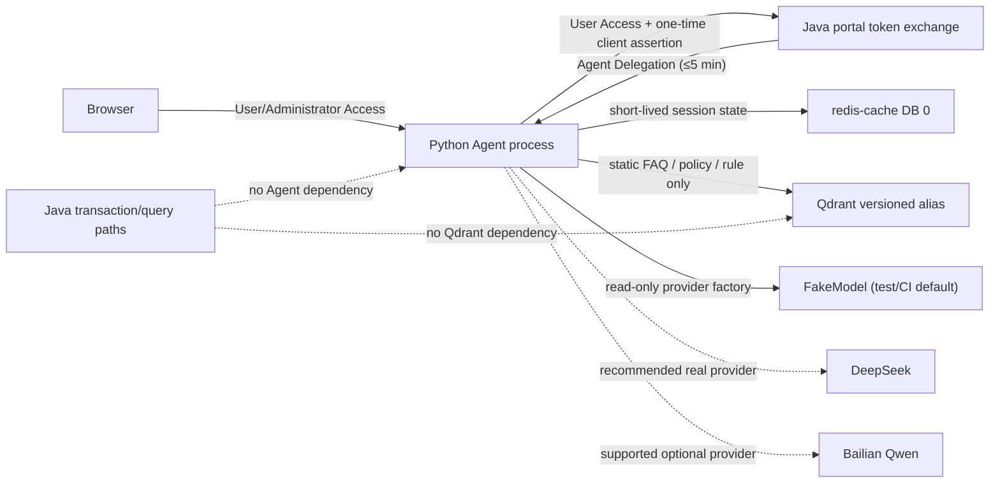
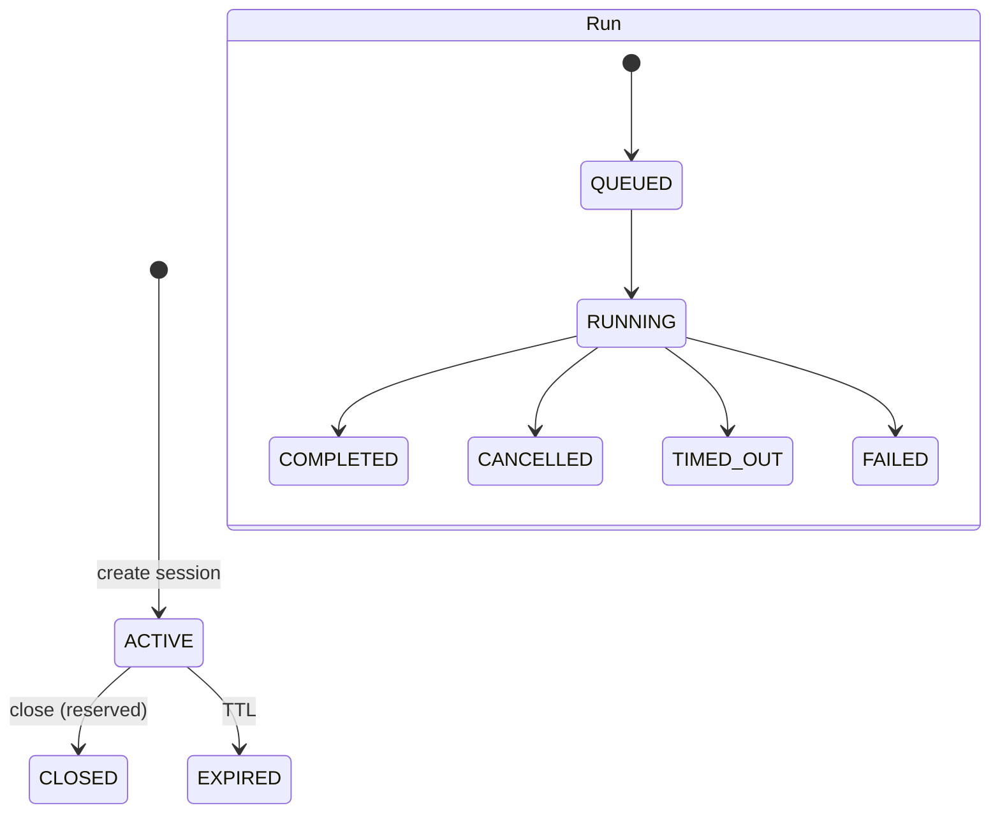

# Agent 进程架构

## 目标与进程边界

HotShop 使用模块化、多进程架构。Python Agent 是可独立部署和停止的辅助进程，通过明确的 HTTP
边界与 Java portal 交互；它不是交易核心，也不被称为微服务。浏览、下单、订单查询和支付等普通
Java 路径不调用 Agent，因此模型或 Agent 故障不会扩散到交易核心。

## 身份域

| Python API 边界 | 接受凭据 | 本地校验 | Token exchange | 工具注册表 |
| --- | --- | --- | --- | --- |
| `/api/v1/agent/**` | User Access | RS256、`kid`、issuer、audience、`typ`、时间和 User claims | 建会话时必须执行并复验 Delegation | 空 |
| `/admin/api/v1/agent/**` | Administrator Access | 独立 RS256 key set、issuer、audience、`typ`、时间和 authorities | 禁止 | 空 |
| Java exchange 返回 | Agent Delegation | 独立 key set、issuer、audience、`typ`、时间、`azp`、scope、无管理员 claims | 不适用 | 不适用 |

三类 Token 不可互换。Python 只持有 Agent Service assertion 私钥和三类验证公钥。一次性 assertion
使用 `client-auth+jwt`、固定 audience/client ID、最长 60 秒和随机 UUID `jti`。Java 负责 assertion
防重放并签发不可刷新、最长五分钟的 Delegation。

## 会话和运行状态

`StateStore` 隔离存储实现。pytest 使用带锁的内存存储；Docker 使用 `redis-cache` 和
`hotshop:agent:` 前缀，session/message 默认 3600 秒、run 默认 900 秒。Agent 不读取 MySQL。
运行中的 asyncio task 和 SSE queue 只存在于创建运行的进程内；客户端断开、显式取消或进程关闭
都会取消 task，并等待 provider 流清理。模型流使用显式 `aclosing` 生命周期，即使取消发生在
SSE 队列写入而不是 provider 内部，provider 的 `finally` 和并发 limiter 也必须先释放，run task
才允许结束。

## 模型与流

LangGraph 负责在 User/Administrator 两条边界施加不同静态策略，再将模型输入交给
`ModelProvider`。TASK-15 的两套 `ToolRegistry` 均为空，不接受 URL、SQL、Shell 或动态工具名。

进程只从可信启动配置 `AGENT_MODEL_PROVIDER=fake|deepseek|qwen` 选择一个 Provider，不按请求切换，
也不自动跨厂商 fallback。Container 只调用只读 factory；AgentService、LangGraph、RAG 和
ToolRegistry 不包含厂商 URL、模型名、Key 或厂商条件分支。DeepSeek 与 Qwen 共享
OpenAI-compatible Chat Completions/SSE transport，adapter 只声明默认配置、扩展字段和 capability。
DeepSeek 显式关闭 thinking，任何 `reasoning_content` 都在 transport 层忽略。

运行 SSE 只允许：

`session.created`、`message.started`、`message.delta`、`message.completed`、`usage`、`error`、`done`。

每类事件还有独立字段白名单。模型 delta 在输出前经过有状态 `StreamingSanitizer`。状态机只保留
可能形成 Bearer/JWT、敏感赋值、私钥块或隐藏标签的未决候选；普通文本立即按顺序输出。候选缓冲上限
为 4096 个 Unicode 字符，超限后立即输出一次 `[REDACTED]`，随后只用有界尾窗口丢弃到空白分隔符或
对应结束标记。正常完成显式 flush；取消和异常直接丢弃未决候选，禁止把尚未判定安全的 carry 输出。
因此敏感值即使跨任意模型 chunk，也不能由客户端重组出来。

系统策略、隐藏推理、凭据和完整模型请求不进入事件或日志。Prometheus 只使用代码 allowlist 的
provider/model 维度记录输入/输出 token、估算费用、活跃运行数和最终状态，不记录 prompt 或响应正文。

TASK-17 在模型之前增加代码拥有的事实路由。FAQ、售后政策、静态活动规则才进入 Qdrant；价格、
实时库存、当前可售性、本人订单和预约状态强制进入 TASK-16 工具。检索 filter 的 tenant、visibility、
documentType、有效期和 limit 全由服务端根据已验证身份构造。检索正文作为“不可信证据”放在固定策略
之后，RAG 分支禁止工具调用；`rag.completed` 只返回结构化引用。无命中、低分或 Qdrant 故障时明确
拒答/降级，不用静态知识猜动态事实。完整设计见 `docs/architecture/agent-rag.md`。

## 可用性保护

provider 外层统一提供整流超时、安全错误重试、熔断、全局并发和按 User 并发限制。临时故障只有在
尚未产生 delta 时才允许重试；超时和取消通过结构化 error/done 收束。Redis 或 provider 不就绪只
影响 Agent readiness/运行，不改变 Java 服务的依赖图。

每个 run 的 SSE queue 固定为 128 槽，不允许无限缓存。普通 delta 使用阻塞式背压，让模型生产速度
受消费者约束。终态不参与阻塞背压：完成、失败或取消会在事件循环内原子地排空并重建队列，优先淘汰
最旧 `message.delta`，必要时再淘汰最旧非终态事件，为结构化 `error`/`done` 或
`message.completed`/`done` 保留空间。终态投递不执行 await，因此满队列且没有消费者时仍能保存
run 终态、设置 done event、释放 provider、并发额度和 active-run 指标。
