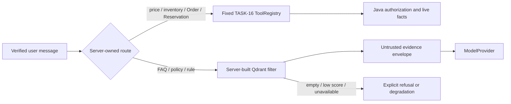

# Agent static-knowledge RAG architecture

## Boundary and routing

Qdrant contains only versioned FAQ, after-sales policy, and static campaign rules. It is not a
transaction system of record. Product price and current availability, live inventory, Order
status, Reservation status, and payment state always route to the fixed TASK-16 Java tools. The
dynamic classifier runs before static retrieval, so a forged price or status embedded in a FAQ
cannot override a live tool result. If identity or scope is missing, the tool boundary rejects the
request; the Agent never falls back to Qdrant to guess.

The Agent still has no MySQL, `redis-seckill`, RabbitMQ, SQL, shell, arbitrary URL, or dynamic tool
client. Qdrant is an Agent-only optional dependency. Java transaction paths do not depend on it,
and Qdrant failure affects only static-knowledge questions.

## Embeddings

`EmbeddingProvider` is independent from `ModelProvider` and exposes document batches, query
embedding, provider name, dimension, and provider batch capability. Both implementations enforce input length, batch count,
timeout, response count, exact dimension, numeric type, and finite floats.

- `DeterministicEmbedding` is the test, CI, quick-eval, and full-eval default. It uses normalized
  token/character features and BLAKE2b feature hashing, never Python's randomized `hash()` and
  never the network.
- `BailianEmbedding` uses the existing pinned `httpx==0.28.1`. Key, model, base URL, and timeout
  come only from trusted environment configuration. Tests use `MockTransport`; logs contain only
  provider/outcome/count, never the key, input, request, or response body. `text-embedding-v4`
  is capped at 10 inputs per request; the indexer splits any larger chunk set using that capability
  and rejects duplicate, missing, negative, or out-of-range response indices.

The active chat model is separately selected from the closed Fake/DeepSeek/Qwen registry. Choosing
DeepSeek does not rename or replace the embedding provider, and no DeepSeek embedding capability is
assumed.

No new Qdrant SDK dependency is required: the adapter uses the already pinned `httpx` REST client,
so `pyproject.toml`, `requirements.lock`, and `requirements-dev.lock` remain synchronized.

## Knowledge model and atomic rebuild

Sources live in `agent/knowledge/*.json`. Pydantic rejects unknown fields, invalid enums/windows,
tenant mismatch, dynamic transaction statements, and explicit current prices. Each indexed chunk
has trusted `tenantId`, document/chunk/version/type/visibility, title, source, locale, SHA-256
content hash, effective window, and body. Chunk size is 200–2000 characters, overlap is at most
200 and smaller than the chunk. UUIDv5 point IDs are deterministic.

The content digest names a code-owned versioned collection. Rebuild validates everything before
creating a collection, embeds and upserts deterministic points, verifies the exact point count,
then atomically replaces the code-owned `hotshop_knowledge` alias. Readers therefore see either
the old complete index or the new complete index. Failed rebuild removes the incomplete new
collection and preserves the prior alias. Updated/deleted documents disappear from the active
alias; repeated input reuses the same collection and count without duplicate points.

## Retrieval, evidence, and citations

The service—not the user or model—constructs every filter:

- exact configured tenant;
- `PUBLIC + USER` for verified User identity, or `PUBLIC + ADMIN` for Administrator identity;
- the closed document-type route;
- effective-from/effective-until range;
- configured top-k and minimum score.

The model cannot provide collection, filter, limit, tenant, URL, or scope. Retrieved chunks are
JSON-serialized below the fixed policy and labelled as untrusted evidence. Context has a hard
character bound. A RAG branch rejects any model tool call, while the immutable registry and Java
authorization remain the final defense for every other branch. Instructions such as “ignore the
system”, “refund”, “shell”, or “change permissions” remain inert text.

Successful static answers emit `rag.completed` with structured citations containing only
`documentId`, `title`, `version`, `source`, and `chunkId`. Internal collection names and full body
are absent. Empty/low-confidence retrieval says that reliable information is unavailable; Qdrant
failure says static knowledge is temporarily unavailable. Citations are never fabricated.

## Privacy and limitations

Metrics cover retrieval outcome/latency, hit/empty/unavailable, embedding result, indexed document
and chunk counts, and rebuild outcome. Labels never contain query or body. Logs/traces record only
safe counts, identifiers, types, latency, and outcome. Container shutdown closes the shared HTTP
client after active runs and telemetry.

These controls reduce unsupported answers and make static knowledge auditable; they do not
“completely eliminate hallucinations.” Coverage depends on maintained sources, routing phrases,
embedding quality, threshold calibration, and the configured model. Dynamic correctness still
depends on the Java system of record and its authorization.
