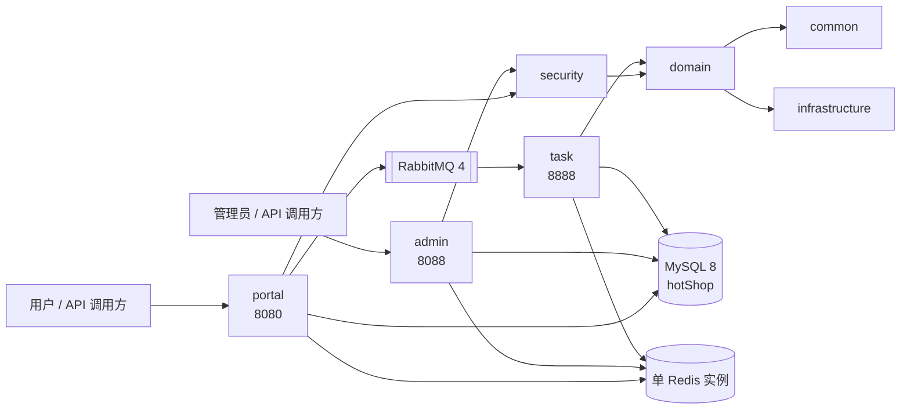

# HotShop 当前架构基线

> 快照范围：TASK-00，2026-07-26。本文描述的是当前工作区事实，不代表目标架构已经实现。
> `Dockerfile`、`docker-compose.yml`、`.dockerignore` 与 `docker/rabbitmq/` 在 TASK-00
> 开始前已有用户未提交修改；下文按当前工作区盘点，但 TASK-00 未改写这些文件。
> 数据库第 4 节及相关已知问题已由 TASK-02 更新到 Flyway 1.1 基线。

## 1. 运行时全景

HotShop 是一个 Maven 多模块、三个 Spring Boot 进程的单仓库应用。`common`、`infrastructure`、
`domain`、`security` 是共享类库，`portal`、`admin`、`task` 是可启动进程。



当前不是微服务架构，也没有服务注册、配置中心、API 网关或分布式事务框架。进程之间目前只通过
RabbitMQ 的订单超时消息发生异步协作。

## 2. Maven 模块与依赖

父工程为 `com.real:hotShop:0.0.1-SNAPSHOT`，当前使用 Java 17、Spring Boot 3.4.3、
MyBatis Spring Boot Starter 3.0.4。仓库有 `.mvn/` 目录，但没有 `mvnw` 或 `mvnw.cmd`。

| 模块 | 类型 | 直接项目依赖 | 主要职责 |
| --- | --- | --- | --- |
| `common` | library | 无 | 枚举、异常、分页与重试工具、共享 JWT 配置 |
| `infrastructure` | library | 无 | Redis Template 工厂、RabbitMQ 拓扑、OpenAPI、共享数据源/Redis 配置 |
| `domain` | library | `common`, `infrastructure` | 实体、MyBatis Mapper、用户/商品/订单服务 |
| `security` | library | `domain` | Spring Security、JWT、Token 黑名单 |
| `portal` | application | `security` | 用户认证、商品、用户与订单 HTTP API |
| `admin` | application | `security` | 管理员认证、用户、商品与订单 HTTP API |
| `task` | application | `domain` | RabbitMQ 超时消费与定时订单扫描 |

因为 `security -> domain -> infrastructure/common`，`portal` 和 `admin` 会传递获得数据库、Redis、
RabbitMQ/OpenAPI 等能力；`task -> domain` 也会传递获得这些能力。

## 3. 启动入口、配置与端口

### 3.1 Java 入口

| 进程 | main class | 扫描范围 | Mapper 扫描 | 默认端口 |
| --- | --- | --- | --- | --- |
| portal | `com.real.portal.hotShopPortalApplication` | `common`, `infrastructure`, `security`, `domain`, `portal` | `com.real.domain.mapper` | 8080 |
| admin | `com.real.admin.hotShopAdminApplication` | `common`, `infrastructure`, `security`, `domain`, `admin` | `com.real.domain.mapper` | 8088 |
| task | `com.real.task.hotShopTaskApplication` | `common`, `infrastructure`, `domain`, `task` | `com.real.domain.mapper` | 8888 |

### 3.2 配置加载

- 三个进程都从各自的 `application.yml` 启动；`SPRING_PROFILES_ACTIVE` 默认为空，不会自动启用
  `dev`。
- 三个进程都导入 `classpath:config/common-db.yml`、`common-redis.yml`；
  `portal` 和 `task` 还导入 `common-jwt.yml` 与 `orderTimeoutConfig.yml`，`admin` 导入
  `common-jwt.yml`。
- `application-prod.yml` 只有显式激活 `prod` 时生效；`application-dev.yml` 只有显式激活
  `dev` 时生效。
- 数据源默认指向 `localhost:3306/hotShop`，Redis 默认 `localhost:6379`，
  RabbitMQ 默认 `localhost:5672`。
- Compose 内应用使用服务名 `mysql`、`redis`、`rabbitmq` 和容器端口。宿主机映射端口不同：
  MySQL 4306、Redis 7379、RabbitMQ AMQP 6672、RabbitMQ Management 15673。
  因此从宿主机直接启动 Java 进程时，必须显式覆盖基础设施端口；当前 YAML 只提供了 host
  环境变量，没有为这些宿主机映射端口提供统一启动命令。
- `rabbitmq.enabled=true` 时加载 `RabbitMQConfig` 和 `RabbitMQService`；admin 将其设为
  `false`，portal/task 为 `true`。

### 3.3 Compose 服务

当前 Compose 定义 `mysql`、`redis`、`rabbitmq`、`portal-service`、`admin-service`、
`task-service`。MySQL、Redis、RabbitMQ 使用持久卷；三个应用由根 `Dockerfile` 的 Maven
builder 阶段按模块构建。当前工作区的 RabbitMQ 镜像会下载并启用
`rabbitmq_delayed_message_exchange` 插件，这与总纲最终约束不一致，留待 TASK-03/TASK-09
处理。

## 4. 数据库基线

TASK-02 已将结构事实切换到 `database/src/main/resources/db/migration`。Compose 的一次性
`database-migrator` 是唯一迁移执行者，三个 Java 进程显式关闭 Flyway 并等待迁移成功；旧
`docker/mysql/init.sql` 及其自动挂载已移除。

当前版本 `1.1` 包含 `app_user`、`catalog_product`、`flash_sale_activity`、`sale_reservation`、
`sales_order`、`sales_order_item`、`payment_order`、`refresh_token`、`outbox_event`、
`processed_event`、`audit_log`。所有跨表 ID 都由应用层校验；结构使用业务唯一键、CHECK、
NOT NULL、精确金额和查询驱动索引维持局部一致性。完整表、状态、索引和接管说明见
`docs/architecture/database-schema.md`。

旧四表可通过显式 version 0 baseline 接管；普通 migrate 不会自动接管非空未知 schema。版本 1.1
会导入兼容数据后移除旧裸表名。开发数据和压测数据位于 `database/data`，不属于生产迁移且不会自动执行。

库存扣减位于 `domain/.../ProductMapper.xml` 的 `reduceStock`：

```sql
UPDATE catalog_product
SET stock = stock - #{quantity}
WHERE product_id = #{productId}
  AND #{quantity} > 0
  AND stock >= #{quantity}
  AND deleted_at IS NULL
```

它把正数量、库存足够和未删除检查与扣减放在同一条 SQL 中，调用方以受影响行数为 0 判断失败；
表级 `stock >= 0` 再提供兜底。version 列已预留，TASK-02 不提前改造后续交易并发流程。

## 5. Redis 基线

当前只有一个 Redis 容器，但应用可按逻辑 DB 0–15 动态创建和缓存 `RedisTemplate`。
Key 使用 JDK value 序列化：

| Key 模式 | DB | 值 | TTL | 写入方 |
| --- | --- | --- | --- | --- |
| `jwt:blacklist:{sha256(token)}` | 0 | `"invalid"` | Token 剩余秒数 | `TokenBlacklistService` |
| `lock:order:{orderId}` | 15 | `true` | 10 秒 | `OrderTimeoutConsumer` |

订单锁使用 `SET NX EX` 获取，但释放是无条件 `DEL`，没有随机所有者令牌和 compare-and-delete。
该 Key 只用于 RabbitMQ 超时消费者，不用于创建订单。

## 6. RabbitMQ 基线

`rabbitmq.enabled=true` 时声明：

| 类型 | 名称 | 配置 |
| --- | --- | --- |
| Custom exchange | `order.delay.exchange` | durable、type=`x-delayed-message`、`x-delayed-type=direct` |
| Queue | `order.delay.queue` | durable、`x-max-length=10000` |
| Binding | queue → exchange | routing key=`order.delay.routingKey` |

portal 创建订单后发送持久化延迟消息，message body 是 `orderId`；task 的
`OrderTimeoutConsumer` 监听队列。当前发送没有提供 `CorrelationData`，没有启用 mandatory/
return callback；confirm callback 只在 nack 时输出一行。消费者使用容器默认 ACK 行为。

另有 `OrderTimeoutJob` 每 60 秒查询一次早于阈值的 PENDING 订单并用 parallel stream 取消，
与 RabbitMQ 超时消费路径并存。

## 7. HTTP 接口

Spring Security 当前允许匿名访问认证入口、portal 商品接口和 OpenAPI/Swagger 静态资源；
其余请求要求认证。下表仅盘点映射，不代表权限或业务语义已经满足总纲。

### 7.1 Portal（8080）

| Method | Path | 入口 |
| --- | --- | --- |
| POST | `/portal/auth/register` | 注册 |
| POST | `/portal/auth/login` | 登录 |
| POST | `/portal/auth/logout` | 登出 |
| POST | `/portal/auth/refresh` | 刷新令牌 |
| GET | `/portal/products/{productId}` | 商品详情 |
| GET | `/portal/products/page` | 商品分页 |
| GET | `/portal/products/all` | 全部商品 |
| GET | `/portal/products/search` | 商品条件搜索 |
| GET | `/portal/users/me` | 当前用户 |
| POST | `/portal/orders/add` | 创建订单并发送超时消息 |
| GET | `/portal/orders/page` | 当前用户订单分页 |
| GET | `/portal/orders/search` | 当前用户订单条件搜索 |

### 7.2 Admin（8088）

| Method | Path | 入口 |
| --- | --- | --- |
| POST | `/admin/auth/login` | 管理员登录 |
| POST | `/admin/auth/logout` | 管理员登出 |
| GET | `/admin/users/search` | 用户搜索 |
| POST | `/admin/products/add` | 新增商品 |
| PUT | `/admin/products/{id}` | 更新商品 |
| DELETE | `/admin/products/{id}` | 软删除商品 |
| GET | `/admin/products/{id}` | 商品详情 |
| GET | `/admin/products/search` | 商品搜索 |
| GET | `/admin/orders/{orderId}` | 订单详情 |
| GET | `/admin/orders/user/{userId}` | 用户订单 |
| GET | `/admin/orders/search` | 订单搜索 |

两个 Web 应用默认提供 `/v3/api-docs` 与 `/swagger-ui/**`（prod profile 关闭）。Actuator 依赖
存在，但当前没有专门的 exposure 配置。

## 8. 已知问题与后续归属

下列均为 TASK-00 盘点结果，本任务不修复。

| 问题 | 代码位置 | 触发条件与当前后果 | 后续任务 |
| --- | --- | --- | --- |
| RabbitMQ 超时分钟换算错误 | `domain/src/main/java/com/real/domain/infra/RabbitMQService.java:59-65` | 每分钟乘 `30 * 1000`，配置 15 分钟实际延迟约 7.5 分钟 | TASK-09 |
| publisher confirm 不闭环 | `domain/src/main/java/com/real/domain/infra/RabbitMQService.java:22-33,43-51` | 发送不带 CorrelationData；nack 只打印，无持久状态、有限重试、告警或 return 处理 | TASK-09 |
| 简单 Redis 锁释放不安全 | `task/src/main/java/com/real/task/timeoutOrderTask/OrderTimeoutConsumer.java:28-43` | 处理超过 10 秒后锁可能被他人重新取得，旧消费者 finally 中无条件 DEL 会删除新锁 | TASK-08 |
| 两套超时取消路径竞态 | `task/src/main/java/com/real/task/timeoutOrderTask/OrderTimeoutJob.java:32-40` 与 `task/src/main/java/com/real/task/timeoutOrderTask/OrderTimeoutConsumer.java:26-43` | 每分钟扫描和 Rabbit 消费可能并发取消同一订单；状态读取和更新不是一条条件 SQL | TASK-09 |
| 定时扫描无批次/租约 | `task/src/main/java/com/real/task/timeoutOrderTask/OrderTimeoutJob.java:33-40` | PENDING 数据量大或多 task 实例时全量结果并行处理，可能重复、拥塞且不可观测 | TASK-09 |
| 条件扣库存只防正常正数超卖 | `domain/src/main/java/com/real/domain/mapper/ProductMapper.xml:19-23` | 正数并发扣减由条件 SQL 保护；零/负数量未校验，负数会反向增加库存 | TASK-02、TASK-08 |
| 订单创建事务注解被自调用绕过 | `domain/src/main/java/com/real/domain/service/advance/OrderStateService.java:50-93` | `createOrder` 直接调用同类 `tryCreateOrder`，`REQUIRES_NEW` 代理不生效；中途失败重试可能遗留部分扣减 | TASK-08 |
| 数据库结构与 Mapper 兼容 | `database/src/main/resources/db/migration/`、`domain/.../mapper/*.xml` | TASK-02 已切换 Flyway、移除旧初始化源并用真 MySQL 测试重命名兼容；后续业务仍须实际调用应用层引用校验 | TASK-07、TASK-08 |
| RabbitMQ 依赖 delayed-message 插件 | `infrastructure/src/main/java/com/real/infrastructure/RabbitMQ/RabbitMQConfig.java:29-40`、`docker/rabbitmq/Dockerfile` | 无插件时 exchange 声明失败；当前工作区镜像主动下载插件 | TASK-03、TASK-09 |
| 旧 Rabbit 测试不是隔离单测 | `task/src/test/java/com/real/task/test/RabbitMQConnectionTest.java:8-19` | `@SpringBootTest` 需要外部 MySQL/Redis/RabbitMQ，且只发送、不断言投递结果 | TASK-01 |
| 构建与跨平台编码基线不完整 | 根 `pom.xml`、缺失的 `mvnw*`/`.gitattributes` | 无 Wrapper；Git `core.autocrlf=true`；未显式按 UTF-8 读取时中文可显示为乱码 | TASK-01 |
| 仓库内存在固定 JWT 密钥和默认凭据 | `common-jwt.yml:2`、各 `application*.yml`、`docker-compose.yml` | 使用默认配置启动会复用仓库值，不满足最终密钥管理要求 | TASK-03、TASK-05 |

编码扫描结果是：当前受检文本文件都能严格按 UTF-8 解码、没有 UTF-8 BOM，也没有检测到已落盘
的常见 mojibake 文本。已观察到的乱码来自 Windows PowerShell 默认读取编码与 UTF-8 文件不一致，
不能伪称为源文件已经损坏。
