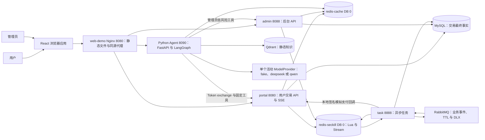
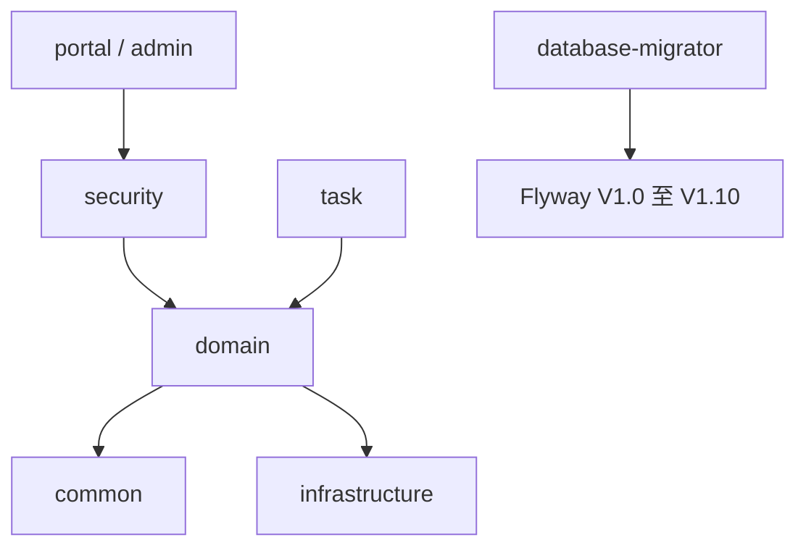
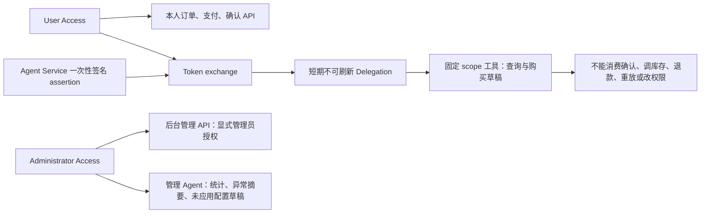
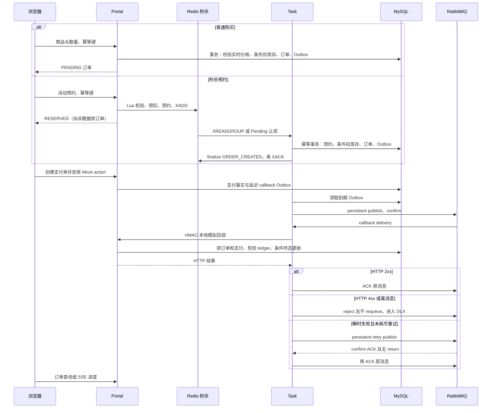
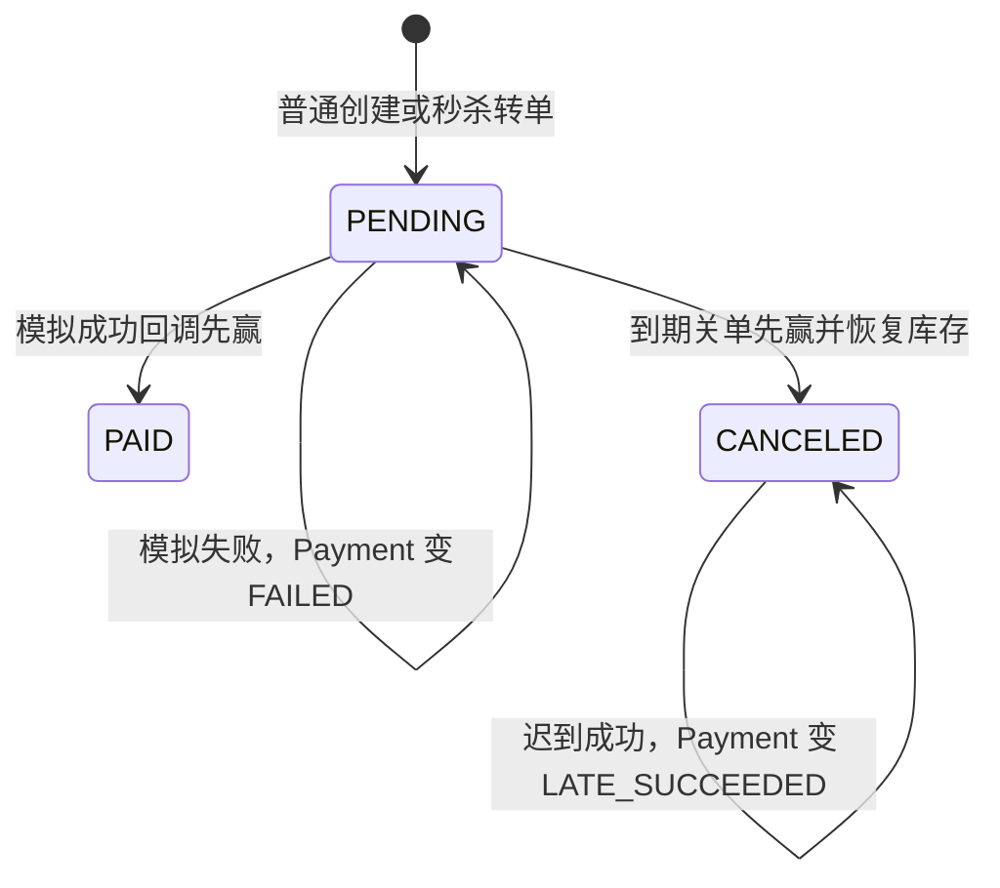

# HotShop 当前架构

> TASK-21 源码快照：`10d82528aab71766ab5aa6020180ae4935f96359`，2026-09-16。
> 本文取代 TASK-00 的运行现状盘点；TASK-21 新增演示 Compose overlay 的差异在下文明确列出，历史测试结果仍以各版本报告为准。

## 1. 系统上下文与运行进程

HotShop 是本地 Docker 演示的模块化、多进程商城。Java 交易核心共享 MySQL，Python Agent 通过受控 HTTP 边界调用 Java；没有服务注册中心或分布式事务框架。模拟支付不连接真实支付通道、不转移资金。

Compose 定义基础设施、一次性 `database-migrator`、`app`、`agent`、`rag`、`observability` profiles。基线根 Compose 不含浏览器静态服务；TASK-21 新增 [docker-compose.demo.yml](../../docker-compose.demo.yml) 的 `web-demo`，用 [web/Dockerfile](../../web/Dockerfile) runtime target 提供 Nginx 静态文件与同源 API 代理（默认宿主机 `127.0.0.1:18080`）。开发时仍可从 `web` 启动 Vite。图中端口是进程端口；宿主机映射由环境文件覆盖，启动以 [README](../../README.md) 为准。监控配置见 [observability](observability.md)。

## 2. 模块与依赖事实

根 [pom.xml](../../pom.xml) 固定 Java 21、Spring Boot 3.5.16、MyBatis Starter 3.0.5；使用仓库 Maven Wrapper。React/TypeScript/Vite 位于 `web`，Python FastAPI/LangGraph 位于 `agent`，精确依赖以各 lockfile 为准。

| 模块 | 职责 |
| --- | --- |
| common | DTO、枚举、审计/错误契约等共享类型 |
| infrastructure | Redis 连接、RabbitMQ 拓扑、观测与基础配置 |
| domain | MyBatis/JDBC 持久化、库存、订单、支付、消息和工具领域逻辑 |
| security | 独立身份域、JWT、refresh、委托与安全过滤器 |
| database | Flyway 迁移及约束测试；不是长期运行的业务进程 |
| portal / admin | 用户 / 管理员 HTTP 边界 |
| task | Stream 转单、补偿、对账、Outbox、超时和支付消息消费者 |
| agent | 固定工具注册表、购买草稿辅助、静态知识检索和受控模型输出 |

## 3. 身份与委托权限

[SecurityConfig](../../security/src/main/java/com/real/security/util/SecurityConfig.java) 按 API 边界选择身份验证；User、Administrator、Agent Delegation 使用独立 issuer/audience 和非对称签名配置。Access JWT 留在浏览器内存。Refresh 是 Cookie 中的不透明随机值，数据库只存 hash；轮换在 MySQL 事务中执行，旧值复用撤销 family。Cookie 路径、CSRF、local HTTP 例外由 [RefreshCookieService](../../security/src/main/java/com/real/security/service/RefreshCookieService.java) 与配置控制，Refresh 不是 JWT。当前仍有 [TokenBlacklistService](../../security/src/main/java/com/real/security/service/TokenBlacklistService.java)：Redis key 为 `hotshop:auth:deny:jti:` 加 jti 的 SHA-256，TTL 为 Access 剩余有效期；[JwtFilter](../../security/src/main/java/com/real/security/util/JwtFilter.java) 在验签后检查它。这里存的是 jti hash，而非原始 Access Token 或其 hash；refresh family 的持久事实仍在 MySQL。

图中拒绝节点表达能力边界。角色字符串、前端隐藏按钮或模型承诺不能替代后端身份、scope 和资源归属校验。用户确认接口只接受 User Access；管理 Agent 不拥有高风险后台工具，详见 [工具与确认](agent-tools-and-confirmation.md)。

## 4. 交易与消息

上图省略重试耗尽后的 reject/DLX 分支；confirm 失败时不得提前 ACK 原消息。图中 PENDING/PAID/CANCELED 是 Order 状态，FAILED/LATE_SUCCEEDED 是 Payment 状态，不能混为同一状态机。支付终态矩阵与锁顺序见 [Mock Payment](mock-payment.md)。Stream 失败恢复见 [Stream 订单处理](stream-order-processing.md)；RabbitMQ、Outbox/Inbox 见 [可靠消息](reliable-messaging.md)。不存在跨 Redis、MySQL、RabbitMQ 的原子提交；对外是至少一次投递和有条件的幂等业务效果，不能声称 exactly-once。

## 5. 库存基线、版本与对账局限

[Flyway V1.9](../../database/src/main/resources/db/migration/V1_9__inventory_accounting_and_adjustments.sql) 以迁移时现存库存建立 `expected_stock`、`expected_available_stock`；新 INSERT 默认复制初值。合法交易扣减、超时恢复、显式库存调整在同一 SQL/事务同步实际值和 expected 值。它能发现只改实际值的偏差，不能证明迁移前库存正确，也不能发现两个字段被同向篡改的全部情形。

[ProductMapper](../../domain/src/main/java/com/real/domain/mapper/ProductMapper.xml) 的元数据更新不写 stock。库存调整使用 signed delta、expectedVersion、原因，并在锁定行后比较版本；旧版本返回 `STOCK_ADJUSTMENT_CONFLICT`，失败不覆盖新库存。版本用于库存并发冲突，不代表商品每个元数据字段都有乐观锁。

[SeckillReconciliationService](../../task/src/main/java/com/real/task/seckill/SeckillReconciliationService.java) 读取同一行实际库存和 expected 值，结合订单、预约、Stream 与账本证据。Redis 守恒扫描使用 [分页 Lua](../../task/src/main/resources/redis/reconcile-conservation-page-v1.lua) 的 `XRANGE COUNT`、持久 cursor、`databaseVersion:inventoryRevision` fence 和按 reservationNo 去重的 seen hash。fence 改变或 seen 丢失会重扫，只有完整且同 fence 的扫描才有守恒结论；`IN_PROGRESS` 不是通过。持续写入可能使扫描长期重启，seen 大小随扫描中不同预约增长，原始 Stream 未自动截断。

对账默认 dry-run、自动修复关闭；issue/checkpoint 是观察元数据，不是业务已修复证明。合法 Catalog 调整不会直接改写 Redis 秒杀配额，活动装载与跨存储证据需要单独调查。更多见 [后台操作](admin-operations.md)。

## 6. 架构决策与导航

保留 [ADR-001 多模型](adr/ADR-001-multi-model-provider.md)，补充以下现行决策记录：

- [ADR-002 模块化多进程](adr/ADR-002-modular-processes.md)
- [ADR-003 双 Redis](adr/ADR-003-dual-redis.md)
- [ADR-004 Stream 与 RabbitMQ](adr/ADR-004-stream-rabbitmq.md)
- [ADR-005 无外键](adr/ADR-005-no-foreign-keys.md)
- [ADR-006 Outbox 与 Inbox](adr/ADR-006-outbox-inbox.md)
- [ADR-007 SSE](adr/ADR-007-sse.md)
- [ADR-008 FakeModel CI](adr/ADR-008-fake-model-ci.md)

静态知识边界见 [RAG](agent-rag.md)，运行生命周期见 [Agent 进程](agent-process.md)，数据库演进见 [数据库结构](database-schema.md)。性能能力只能引用 [TASK-20 报告](../quality/task-20-performance.md) 的实际窗口、完成量和 dropped iterations；目标未达成，不能把 5000 requested RPS 写成稳定承载能力。
