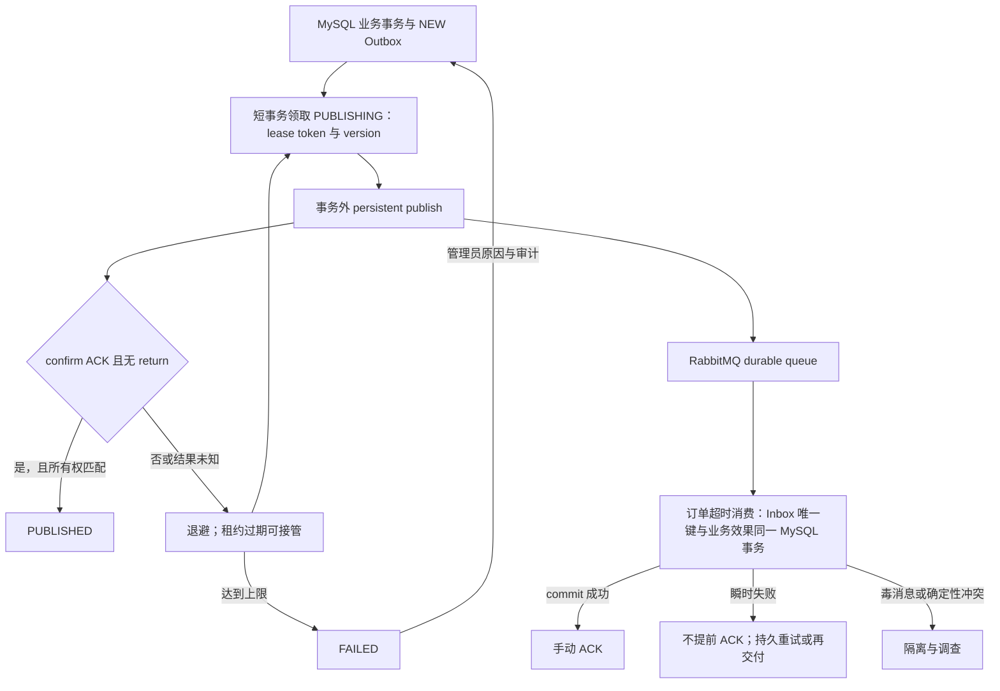

# Reliable messaging

HotShop uses **at-least-once delivery with idempotent business effects**. MySQL is the source of truth for business and publication state; cross-system delivery can repeat after failures.

## Outbox state and ownership

Business transactions insert `outbox_event` rows in `NEW`. A task instance briefly locks due rows with `FOR UPDATE SKIP LOCKED`, changes them to `PUBLISHING`, assigns a random `lease_token`, advances `version`, and commits before contacting RabbitMQ. Expired leases can be reclaimed. Every result update includes both token and version, so a late confirm from an old publisher cannot overwrite the current owner.

`publish_attempts` counts all broker publication attempts over the event lifetime, including attempts whose result is unknown. `consecutive_attempts` counts only the current automatic retry round. Retryable failures use bounded exponential backoff; after the configured maximum the row transitions to terminal `FAILED`. Automatic claiming never selects `FAILED`. Manual replay increments `manual_replay_count`, resets only `consecutive_attempts`, and preserves cumulative publication history. An expired `PUBLISHING` lease already at the limit is fenced into `FAILED` instead of remaining stuck.

An event becomes `PUBLISHED` only after a correlated ACK and absence of a mandatory return. NACK, return, confirm timeout, and connection failure are failures. A crash after broker ACK but before the MySQL update produces a later duplicate, as expected with at-least-once delivery.

## Inbox and timeout topology

The stable consumer `hotshop-legacy-order-timeout-v1` inserts `(consumer_name,event_id)` in `processed_event` in the same transaction as cancellation, payment closure, inventory restoration, append-only `INVENTORY_COMPENSATED` audit, and the deterministic `ORDER_CANCELED` Outbox row. ACK occurs only after commit. Duplicates therefore have no second business effect or duplicate compensation audit.

`LEGACY_ORDER_TIMEOUT_REQUESTED` uses a durable direct schedule exchange and a delay queue whose TTL comes from `HOTSHOP_LEGACY_ORDER_TIMEOUT=15m` (exactly 900,000 ms), plus DLX to the ready queue. Remaining per-message expiration avoids extending a partially elapsed deadline; an already expired event goes directly to the ready exchange. If delivery is early, the consumer atomically records the original Inbox row and a deterministic timeout-reschedule Outbox row before ACK, so it neither hot-requeues nor loses the later timeout opportunity.

The timeout envelope is untrusted input. The consumer rejects unknown fields and verifies schema, UUID event identity, event/aggregate types, aggregate and payload order IDs, User, amount, CNY currency, and expiry against the locked MySQL order. JSON/schema poison and fact conflicts are rejected to the dead-letter queue. Database failures escape without ACK. Database `expires_at <= UTC_TIMESTAMP(6)` remains authoritative.

Ordinary and flash-sale orders are eligible. Flash-sale timeout additionally locks Reservation, Activity and Product after Order and Payment; it restores both MySQL stock projections, marks the Reservation `CANCELED`, and writes `SECKILL_PAYMENT_EXPIRED` without a MySQL/Redis dual write.

## FAILED operations

Administrators with `ROLE_ADMIN` list redacted failures at `/admin/api/v1/outbox/failed`, then POST `/admin/api/v1/outbox/{eventId}/replay` with a reason. HTTP only changes MySQL; publication remains asynchronous. Published events cannot be replayed. Every attempt appends an audit record, and no Agent endpoint exposes this operation.
# TASK-10 payment messaging

`MOCK_PAYMENT_CALLBACK_REQUESTED` 使用 Outbox `available_at` 持久表达延迟，发布到 durable Mock callback queue。HTTP 5xx/连接错误进入有限 durable retry，4xx 进入 DLQ，2xx 才 ACK。`PAYMENT_SUCCEEDED`、`PAYMENT_FAILED`、`PAYMENT_LATE_SUCCEEDED` 和 `SECKILL_PAYMENT_EXPIRED` 均路由到独立 durable queue；mandatory return 和 publisher confirm 语义保持不变。at-least-once 重投由 callbackId/payload hash、nonce hash 和条件状态更新保证不重复业务效果。

Mock callback 与秒杀 Redis 投影都采用 `main -> TTL retry -> main` 的持久拓扑，并有各自的 DLQ。每次失败把递增 attempt header 写入新 persistent 消息，correlated confirm ACK 且无 return 后才 ACK 原消息；最终尝试直接 reject 到 DLQ。Schema/确定性事实冲突不重试。测试使用真实 RabbitMQ 证明持续 503/Redis 故障到达上限、队列清空，以及删除 retry exchange 产生 publish NACK 时原 delivery 不会提前 ACK。

`SECKILL_PAYMENT_EXPIRED` 的 Lua 同时核对 Reservation、Order、Activity、User、Product 和 quantity。`COMPENSATED` 与 `IDEMPOTENT` ACK；Redis 瞬时异常进入 retry；事实冲突和毒消息进入 `hotshop.seckill.payment-expired.dead.v1`。这仍是 at-least-once + 幂等投影，不是 exactly-once 消息投递。

## Delivery and recovery overview

The generic diagram does not imply all consumers use the same retry implementation: timeout database failures remain unacknowledged; Mock callback and Redis payment-expiry projection use confirmed persistent retry publication. A broker ACK followed by publisher death before `PUBLISHED`, or a consumer commit followed by death before ACK, can both repeat delivery. Business idempotency depends on the retained Inbox/ledger and business keys, not on broker delivery uniqueness.

Stream recovery is a separate path: pending ownership is reclaimed by `XAUTOCLAIM`, the MySQL processing ledger determines the next step, Redis finalize/compensation is checked idempotently, then `XACK` removes the pending entry. `XACK` does not delete the Stream record. See [Stream recovery matrix](stream-order-processing.md#9-崩溃恢复矩阵).
